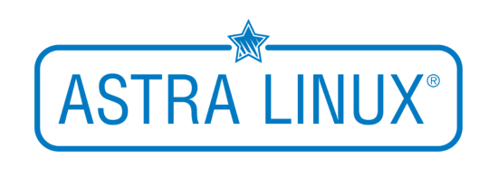

# 2. Основные направления дистрибутивов GNU/Linux.

В предыдущем файле было рассмотрено понятие дистрибутивов GNU/Linux, а так же их классификация по способу поддержки и обновления. В этом файле будут рассмотрены сформировавшиеся направления (ветви) дистрибутивов GNU/Linux и рассмотрены более подробно основные из них.

## Понятие системы управления пакетами

Одной из ключевых особенностей дистрибутива, помимо модели поддержки и обновления, является используемая им **система управления пакетами** (также **менеджер пакетов** или **пакетный менеджер**) - набор программного обеспечения, позволяющего управлять процессом установки, удаления, настройки и обновления различных компонентов программного обеспечения. Программное обеспечение поставляется в виде особых пакетов, содержащих, помимо дистрибутива программного обеспечения, **набор определенных метаданных**, которые могут включать в себя *полное имя пакета*, *номер версии*, *описание пакета*, *имя разработчика*, *контрольную сумму* и пр.

# Направления дистрибутивов GNU/Linux.

В этом разделе будут перечислены крупнейшие дистрибутивы Linux.
- **Slackware** - один из старейших дистрибутивов Linux, первая версия вышла 17 июля 1993 года (то есть спустя 2 года после выхода ядра Linux версии 0.01). В настоящее время данный дистрибутив является не самым популярным, поэтому подробно рассмотрен не будет;
- **Debian** - другой старейший дистрибутив, вышедший 16 августа 1993 года. В отличие от Slackware, Debian широко используется на рынке серверов и персональных компьютеров;
- **Red Hat Linux** - дистрибутив, разработанный компанией *Rad Hat*. Выпускался в период с 1995 по 2003 год. Red Hat Linux, так же, как и Debian, положил начало большому количествую популярных дистрибутивов;
- **Arch Linux** - дистрибутив, предназначенный для опытных пользователей. На его основе также создано большое количество дистрибутивов;
- **Gentoo** (дже́нту, жаргон — ге́нту, ге́нта) - дистрибутив GNU/Linux с мощной и гибкой технологией *Portage*, совмещающей в себе возможности конфигурирования и настройки, а также автоматизированную систему управления пакетами. Данный дистрибутив, также, как и Arch Linux, предназначен для опытных пользователей и не будет рассмотрен.

Кроме перечисленных ключевых дистрибутивов существует большое количество других, в том числе независимых, одним из которых является **Android** - операционная система для смартфонов, планшетов, электронных книг, смарт-часов и других устройств. Несмотря на то, что Android официально не является дистрибутивом GNU/Linux, он основан на ядре Linux.

В следующих разделах подробно рассматриваются ключевые дистрибутивы GNU/Linux, а так же дистрибутивы, основанные на них.

# Debian

**Debian** - операционная система, состоящая из свободного ПО с открытым исходным кодом. В настоящее время Debian GNU/Linux - один из самых популярных и важных дистрибутивов GNU/Linux, оказавший значительное влияние на развитие этого типа операционных систем в целом.

Debian имеет наибольшее среди всех дистрибутивов *хранилище пакетов* (репозиторий) - в репозитории текущей стабильной версии Debian 11 "Bullseye" содержится почти 60000 пакетов с программным обеспечением различного назначения. Данный дистрибутив, а также дистрибутивы, основанные на Debian, используют систему управления пакетами **dpkg** (Debian PacKaGe), а так же созданный на его основе **Advanced Packaging Tool (APT)**.

Debian является *LTS дистрибутивом* с жестким графиком выхода новых версий - каждые 2 года. Выпуски Debian разделены на 6 веток:
- oldoldstable - содержит пакеты предыдущего oldstable дистрибутива, является более неподдерживаемой версией;
- oldstable (старая стабильная) - содержит пакеты предыдущего stable (стабильного) дистрибутива, находится в официальной LTS поддержке;
- stable (стабильная) - содержит пакеты, вошедшие в последний официальный дистрибутив (обновление пакетов в нем происходит только для устанения уязвимостей);
- testing (тестируемая) - ветвь, из которой будет формироваться следующий стабильный релиз;
- unstable (нестабильная) - содержит новые версии пакетов, которые готовятся к помещению в тестируемую ветку;
- experimental (экспериментальная) - не является полноценной веткой, в ней находятся пакеты, требующие тщательного тестирования или которые повлекут серьезные изменения в дистрибутиве.

Стабильные и тестируемая версии операционной системы Debian называются именами персонажей мультфильма «История игрушек». Нестабильная версия дистрибутива Debian постоянно носит кодовое имя Сид (sid), по имени отрицательного персонажа из мультфильма, который ломал игрушки.

В настоящее время стабильной версией является *Debian 11 "Bullseye"*, старой стабильной - *Debian 10 "Buster"*, тестируемой - *Debian 12 "Bookworm"*.

На основе Debian создано огромное количество дистрибутивов, некоторые из которых будут рассмотрены далее.

## Ubuntu

**Ubuntu** ("Убу́нту") - дистрибутив GNU/Linux, основанный на *Debian testing*. Основным разработчиком и спонсором является компания **Canonical**. Является самой популярной операционной системой из используемых на веб-серверах.

Десктопная редакция изначально использовала среду рабочего стола *GNOME*. Начиная с версии 11.04, использовалось окружение рабочего стола *Unity*, но в 2017 году в Ubuntu снова стал использоваться рабочий стол **GNOME**.

Ubuntu поставляется в двух основных редакциях - **Ubuntu**, являющаяся версией для персональных компьютеров и ноутбуков, и **Ubuntu Server**, являющаяся серверной версией системы. Кроме них существуют также и другие проекты, например *Ubuntu Core*, которая может работать на IoT-устройствах и роботах.

Новые версии системы выходят 2 раза в год - *в апреле и в октябре*. LTS версии выходят *раз в 2 года в апреле*. Номер версии представляет собой 2 числа вида XX.XX, где первые 2 цифры - год выхода версии, вторые 2 цифры - месяц (например, 22.04 - апрель 2022 года, 22.10 - октябрь 2022 года и т. д.). Версии LTS обозначаются таким же образом, но с добавлением LTS после номера, например, 20.04 LTS, 22.04 LTS и др.

Дистрибутив Ubuntu долгое время оставался ведущим в сфере внедрения новых технологий в системы семейства Linux, пока его не сместил другой дистрибутив, который будет рассмотрен позднее.

На основе Ubuntu создано большое количество дистрибутивов, один из которых будет рассмотрен далее.

### Linux Mint

**Linux Mint** - развиваемый сообществом дистрибутив GNU/Linux, основанный на Ubuntu. Целью проекта является предоставление "современной, элегантной и удобной операционной системы, которая одновременно является мощной и простой в использовании".

Linux Mint представляет собой десктопную операционную систему, включающую в свой состав окружение рабочего стола **Cinnamon**. Данное рабочее окружение создано с целью быть максимально простым в использовании, но при этом функциональным. Внешне рабочее окружение Cinnamon очень похоже на интерфейс Windows, что упрощает переход пользователей с одноименной системы на Linux Mint. Кроме Cinnamon существуют также выпуски с рабочими окружениями **MATE** и **Xfce** для работы на слабых компьютерах.

Далее будут рассмотрены некоторые другие дистрибутивы GNU/Linux, основанные на Debian.

## Kali Linux

**Kali Linux** - операционная система GNU/Linux, основанная на Debian и разработанная компанией *Offensive Security*. Предназначена для тестирования систем безопасности.

В состав дистрибутива входит более 600 программ для взлома, включая сканеры портов, инструменты для взлома паролей и беспроводных сетей, анализаторы сетевого трафика, базы данных известных уязвимостей и эксплойтов и другое хакерское программное обеспечение.

Данная операционная система широко используется специалистами по информационной безопасности для поиска и устранения уязвимостей в информацонных системах.

## SteamOS

**Steam OS** - операционная система, основанная на Debian и разработанная компанией *Valve* специально для сервиса *Steam*.

По утверждениям разработчиков в SteamOS значительно улучшена производительность обработки графики. Велись работы над обработкой звука, а также уменьшением задержки при использовании средств ввода на уровне операционной системы. Кроме того, в состав операционной системы входят проприетарные драйверы для видеокарт и других устройств.

## Astra Linux

**Astra Linux** - операционная система на базе ядра Linux, которая внедряется в России в качестве альтернативы Microsoft Windows. Обеспечивает степень защиты обрабатываемой информации до уровня государственной тайны «особой важности» включительно. Сертифицирована в системах сертификации средств защиты информации Минобороны РФ, ФСТЭК и ФСБ России. Включена в Единый реестр российских программ Минкомсвязи России.

В ходе разработки системы во второй половине 2010-х годов и развития процессов импортозамещения Astra Linux начала широко применяться как универсальная операционная система для персональных компьютеров. По состоянию на 2022 год внедряется в образовательных, медицинских и других государственных учреждениях, а также в компаниях РЖД, «Газпром», «Росатом» и других.

Astra Linux считается «официально признанным» деривативом Debian после прохождения необходимых проверок на соответствие требованиям Debian, разработчик Astra Linux АО «НПО РусБИТех» находится в партнёрских отношениях с The Linux Foundation и The Document Foundation. Разработчик заявляет, что «лицензионные соглашения на операционные системы Astra Linux разработаны в строгом соответствии с положениями действующих правовых документов Российской Федерации, а также международных правовых актов», при этом они «не противоречат духу и требованиям лицензии GPL».

Собственный репозиторий Astra Linux состоит из более чем 20 000 пакетов. На пакетной базе этого репозитория развиваются и другие программные продукты компании. В состав дистрибутива входят такие пакеты с открытым исходным кодом, как графическое окружение пользователя **Fly**, офисный пакет LibreOffice, доработанный в части управления доступом, серверные компоненты (web-сервер, СУБД и так далее), браузер Firefox, почтовый клиент Thunderbird, редактор растровой графики GIMP, проигрыватель мультимедиа VLC и другие.

В феврале 2018 г. объявлено, что Astra Linux была адаптирована для российских микропроцессоров «Эльбрус».

В следующем разделе будет рассмотрен дистрибутив Red Hat и дистрибутивы, основанные на Red Hat.

# Red Hat Linux

**Red Hat Linux** - дистрибутив GNU/Linux компании *Red Hat*. Выпускался в период с 1995 по 2003 год включительно. В 2004 году проект Red Hat Linux официально прекратил свое существование, и вместо него были образованы 2 новых проекта - **Fedora** и **Red Hat Enterprise Linux (RHEL)**. Fedora представляет собой свободный дистрибутив, а Red Hat Enterprise Linux - коммерческий.

Дистрибутивы на основе Red Hat используют систему управления пакетами **RPM** (RPM Package Manager или Red hat Package Manager).

## Fedora

**Fedora** - дистрибутив GNU/Linux, разрабатываемый Проектом Fedora, спонсируемый компаниями Red Hat и IBM и содержащий возможности, которые в будущем предполагаются к использованию в Red Hat Enterprise Linux.

Fedora является *middle-rolling* дистрибутивом. Актуальные версии дистрибутива в период поддержки постоянно получают обновления программ и библиотек, включая новые стабильные версии ядра Linux. Новые версии системы выходят каждые 6-8 месяцев.

С момента выпуска Fedora 30 в настоящее время доступны следующие основные редакции:
- *Fedora Workstation* - десктопная операционная система, использующая *GNOME* в качестве рабочего окружения по умолчанию. Кроме этого, существуют официальные сборки (spins - спины), предлагающие окружения KDE, LXDE, LXQT, Xfce, Cinnamon и другие;
- *Fedora Server* - серверная операционная система, включающая в свой состав новейшие технологии центров обработки данных. Это издание не поставляется с графическим рабочим столом, но имеется возможность его установки;
- *Fedora Core OS* - автоматически обновляемая, минимальная, ориентированная на контейнеры операционная система;
- *Fedora IoT* - предоставлет проверенную платформу в качестве надежной основы для экосистем IoT.

В начале 2020-х годов дистрибутив Fedora признан сообществом ведущим в области внедрения новых технологий в операционные системы Linux. Фактически Fedora является "обкаточным полигоном" для новых технологий, которые после тестирования попадают в Red Hat Enterprise Linux. В настоящее время Fedora тестирует такие технологии, как файловая система BTRFS, оконная система Wayland и другие.

В Fedora по умолчанию используется **SELinux** - модуль ядра, реализующий множество политик безопасности, включая обязательные средства контроля доступа.

На операционных системах Fedora и RHEL основаны многие другие дистрибутивы, например **CentOS**, являющийся открытой версией RHEL, адаптированной под серверы, **Mandriva Linux**, разработка которого в настоящее время прекращена, и многие другие дистрибутивы.

## Rosa Linux

**Rosa Linux** - линейка дистрибутивов GNU/Linux, изначально основанных на *Mandriva*, разработку которых ведет российская компания "НТЦ ИТ РОСА". В линейку включены серверная версия ROSA Server и настольная версия ROSA Desktop. Для каждой из версий доступны свободно распространяемые редакции, а также построенные на их основе защищённые варианты, сертифицированные ФСТЭК России и российским Министерством обороны.

Свободный настольный вариант дистрибутива для дома называется «Desktop Fresh Rn», где n — номер версии. Версия с длительной поддержкой называется «Rosa Enterprise Desktop Xn» (ранее Marathon), где n — номер версии.

Дистрибутив для серверов называется «Rosa Enterprise Linux Server» (RELS).

Основной продукцией компании являются сертифицированные ФСТЭК и Министерством обороны РФ дистрибутивы, которые носят названия металлов — «Кобальт», «Никель», «Хром», их поддержка и компоновка программными средствами. Этих вариантов нет в свободном доступе.

Разрабатывается вариант мобильной ОС для ARM-процессоров.

В качестве основной графической среды рабочего стола используется KDE. В разное время выпускались дистрибутивы, в том числе сообществом, со средами GNOME, LXDE, LXQt, XFCE4 но им уделяется меньше времени и обеспечения качества.

В следующем разделе будет рассмотрен дистрибутив Arch Linux, а также дистрибутивы, основанные на нем.

# Arch Linux

**Arch Linux** - дистрибутив GNU/Linux Linux для опытных пользователей, оптимизированный для архитектуры x86-64, который стремится предоставить последние «новейшие» версии программ.

Является *rolling* дистрибутивом. По умолчанию пользователю предоставляется минималистичная базовая система, в которую пользователь может добавить то, что ему требуется. Другими словами, Arch Linux является *user-centric* дистрибутивом, то есть ориентированным на конкретных (опытных) пользователей.

Arch Linux и дистрибутивы, основанные на нем, используют систему управления пакетами **Pacman**.

## Manjaro

**Manjaro** - дистрибутив GNU/Linux, основанный на Arch Linux, использующий модель обновления *rolling release*. Официально доступно несколько версий: с рабочим окружением KDE Plasma, GNOME и Xfce.

Manjaro представляет собой "собранный" Arch Linux, упрощенный для использования.

В следующем файле будут рассмотрены процессы и потоки в системах Linux. Тест по теме основных направлений дистрибутивов GNU/Linux доступен в файле `2.lle`
