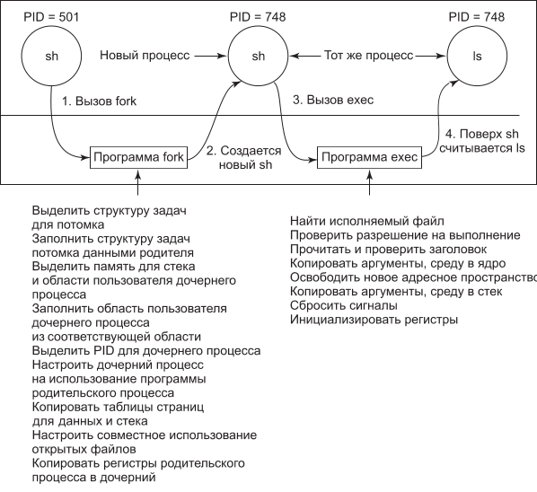
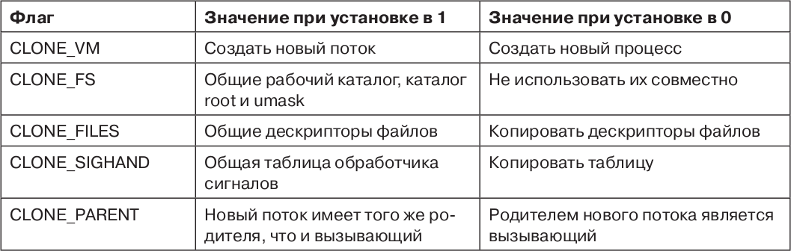
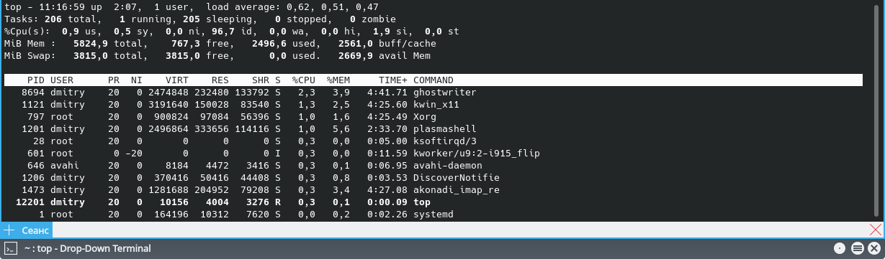
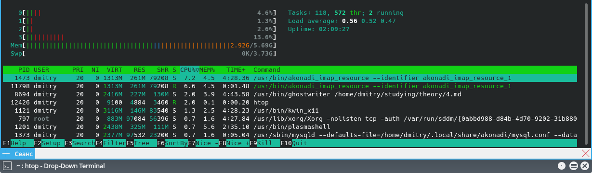
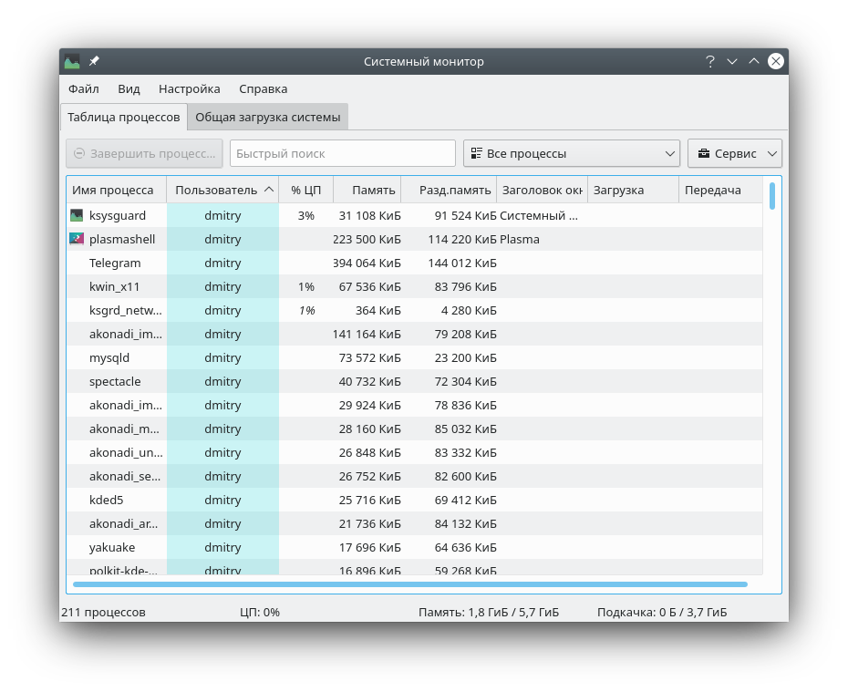

# 3. Процессы и потоки в Linux

## Фундаментальные концепции

Основными активными сущностями в системе Linux являются **процессы**. Процессы Linux очень похожи на классические последовательные процессы - каждый процесс выполняет одну программу и изначально получает один поток управления. Иначе говоря, у процесса есть один счетчик команд, который отслеживает следующую исполняемую команду. Linux позволяет процессу создавать дополнительные потоки (после того, как он начинает выполнение).

Linux представляет собой многозадачную систему и несколько независимых процессов могут работать одновременно. Более того, у каждого пользователя может быть одновременно несколько активных процессов, так что в большой системе могут одновременно работать сотни и даже тысячи процессов. Фактически на большинстве однопользовательских рабочих станций (даже когда пользователь куда-либо отлучился) работают десятки фоновых процессов, называемых **демонами** (*daemons*). Они запускаются при загрузке системы из сценария оболочки.

Типичным демоном является **cron**. Он просыпается раз в минуту, проверяя, не нужно ли ему что-то сделать. Если у него есть работа, он ее выполняет, а затем отправляется спать дальше (до следующей проверки).

Этот демон позволяет планировать в системе Linux активность на минуты, часы, дни и даже месяцы вперед. Например, представьте, что пользователю назначено явиться к зубному врачу в 15.00 в следующий вторник. Он может создать запись в базе данных демона cron, чтобы тот просигналил ему, скажем, в 14.30. Когда наступают назначенные день и время, демон cron видит, что у него есть работа, и в нужное время запускает программу звукового сигнала (в виде нового процесса).

Демон cron также используется для периодического запуска задач, например ежедневного резервного копирования диска в 4.00 или напоминания забывчивым пользователям каждый год 31 октября купить новые «страшненькие» товары для веселого празднования Хэллоуина. Другие демоны управляют входящей и исходящей электронной почтой, очередями принтера, проверяют, достаточно ли еще осталось свободных страниц памяти, и т. д. Демоны реализуются в системе Linux довольно просто, так как каждый из них представляет собой отдельный процесс, не зависимый от всех остальных процессов.

Процессы создаются в операционной системе Linux чрезвычайно просто. Системный вызов **fork** создает точную копию исходного процесса, называемого родительским процессом (parent process). Новый процесс называется дочерним процессом (child process). У родительского и у дочернего процессов есть *собственные (приватные) образы памяти*. Если родительский процесс впоследствии изменяет какие-либо свои переменные, то эти изменения остаются невидимыми для дочернего процесса (и наоборот).

*Открытые файлы используются родительским и дочерним процессами совместно*. Это значит, что если какой-либо файл был открыт в родительском процессе до выполнения системного вызова fork, он останется открытым в обоих процессах и в дальнейшем. Изменения, произведенные с этим файлом любым из процессов, будут видны другому. Такое поведение является единственно разумным, так как эти изменения будут видны также любому другому процессу, который тоже откроет этот файл.

Тот факт, что образы памяти, переменные, регистры и все остальное у родительского и дочернего процессов идентичны, приводит к небольшому затруднению: как процессам узнать, какой из них должен исполнять родительский код, а какой — дочерний? Секрет в том, что системный вызов fork возвращает дочернему процессу число 0, а родительскому — отличный от нуля PID (Process IDentifier — идентификатор процесса) дочернего процесса. Оба обычно проверяют возвращаемое значение и действуют так, как показано в листинге 1.

*Листинг 1 - Создание процесса в системе Linux*

    pid = fork(); // если fork завершился успешно, pid > 0 в родительском процессе

    if (pid < 0)
        handle_error(); // fork потерпел неудачу (например, память или какая-либо таблица переполнена)
    else if (pid > 0) {
        // родительский код
    }
    else {
        // дочерний код
    }
        
Процессы именуются своими PID-идентификаторами. Как уже говорилось, при создании процесса его PID выдается родителю нового процесса. Если дочерний процесс желает узнать свой PID, то он может воспользоваться системным вызовом **getpid**. Идентификаторы процессов используются различным образом. Например, когда дочерний процесс завершается, его родитель получает PID только что завершившегося дочернего процесса. Это может быть важно, так как у родительского процесса может быть много дочерних процессов. Поскольку у дочерних процессов также могут быть дочерние процессы, то исходный процесс может создать целое дерево детей, внуков, правнуков и более дальних потомков.

В системе Linux процессы могут общаться друг с другом с помощью некой формы передачи сообщений. Можно создать канал между двумя процессами, в который один процесс сможет писать поток байтов, а другой процесс сможет его читать. Эти каналы иногда называют **трубами** (pipes). Синхронизация процессов достигается путем блокирования процесса при попытке прочитать данные из пустого канала. Когда данные появляются в канале, процесс разблокируется.

При помощи каналов организуются конвейеры оболочки. Когда оболочка видит строку вроде

    sort <f | head
    
она создает два процесса, *sort* и *head*, а также устанавливает между ними канал таким образом, что стандартный поток вывода программы sort соединяется со стандартным потоком ввода программы head. При этом все данные, которые пишет sort, попадают напрямую к head, для чего не требуется временного файла. Если канал переполняется, то система приостанавливает работу sort до тех пор, пока head не удалит из него хоть сколько-нибудь данных.

Процессы могут общаться и другим способом — при помощи программных прерываний. Один процесс может послать другому так называемый **сигнал** (*signal*). Процессы могут сообщить системе, какие действия следует предпринимать, когда придет входящий сигнал. Варианты такие: проигнорировать сигнал, перехватить его, позволить сигналу убить процесс (действие по умолчанию для большинства сигналов). Если процесс выбрал перехват посылаемых ему сигналов, он должен указать процедуру обработки сигналов. Когда сигнал прибывает, управление сразу же передается обработчику. Когда процедура обработки сигнала завершает свою работу, управление снова передается в то место, в котором оно находилось, когда пришел сигнал (это аналогично обработке аппаратных прерываний ввода-вывода). Процесс может посылать сигналы только членам своей *группы процессов* (process group) , состоящей из его прямого родителя (и других
предков), братьев и сестер, а также детей (и прочих потомков). Процесс может также послать сигнал сразу всей своей группе за один системный вызов.

Сигналы используются и для других целей. Например, если процесс выполняет вычисления с плавающей точкой и непреднамеренно делит на 0, то он получает сигнал *SIGFPE* (Floating-Point Exception SIGnal — сигнал исключения при выполнении операции с плавающей точкой). Сигналы, требуемые стандартом POSIX, перечислены ниже. В большинстве систем Linux имеются также дополнительные сигналы, но использующие их программы могут оказаться непереносимыми на другие версии Linux и UNIX.

Сигналы, требуемые стандартом POSIX:
- SIGABRT - посылается, чтобы прервать процесс и создать дамп памяти;
- SIGALRM - истекло время будильника;
- SIGFPE - произошла ошибка при выполнении операции с плавающей точкой (например, деление на 0);
- SIGHUP - на телефонной линии, использовавшейся процессом, была повешена трубка;
- SIGILL - пользователь нажал клавишу Del, чтобы прервать процесс;
- SIGQUIT - пользователь нажал клавишу, требующую выполнения дампа памяти;
- SIGKILL - посылается, чтобы уничтожить процесс (не может игнорироваться или перехватываться);
- SIGPIPE - процесс пишет в канал, из которого никто не читает;
- SIGSEGV - процесс обратился к неверному адресу памяти;
- SIGTERM - вежливая просьба к процессу завершить свою работу;
- SIGUSR1 и SIGUSR2 - могут быть определены приложением.

## Системные вызовы

В этом разделе перечислены основные системные вызовы для работы с процессами в системах Linux.

Код возврата s в случае ошибки равен -1, pid - идентификатор процесса, residual - остаток времени от предыдущего сигнала.

- **pid = fork()** - создать дочерний процесс, идентичный родительскому;
- **pid = waitpid(pid, &statloc, opts)** - ждать завершения дочернего процесса;
- **s = execve(name, argv, envp)** - заменить образ памяти процесса (по сути запуск процесса на выполнение, также этот системный вызов называют просто *exec*);
- **exit(status)** - завершить выполнение процесса и вернуть статус;
- **s = sigaction(sig, &act, &oldact)** - определить действие, выполняемое при приходе сигнала;
- **s = sigreturn(&context)** - вернуть управление после обработки сигнала;
- **s = sigprocmask(how, &set, &old)** - исследовать или изменить маску сигнала;
- **s = sigpending(set)** - получить набор блокированных сигналов;
- **s = sigsuspend(sigmask)** - заменить маску сигнала и приостановить процесс;
- **s = kill(pid, sig)** - послать сигнал процессу;
- **residual = alarm(seconds)** - установить будильник;
- **s = pause()** - приостановить выполнение вызывающей стороны до следующего сигнала.

Если процесс уже завершился, а родительский процесс не ожидает этого события, то дочерний процесс переводится в так называемое **состояние зомби** (zombie state) - живого мертвеца , то есть приостанавливается. Когда родительский процесс, наконец, обращается к библиотечной процедуре *waitpid*, дочерний процесс завершается.

На рисунке 1 схематично показано создание нового процесса. В качестве примера используется команда *ls* (отображение списка файлов в текущем каталоге), введенная в командной оболочке *sh*.

*Рисунок 1 - Создание нового процесса*

## Реализация процессов и потоков в Linux

Ядро Linux внутренним образом представляет процессы как *задачи (tasks)* при помощи структуры задач *task_struct*. В отличие от подходов других операционных систем (которые делают различия между процессом, легковесным процессом и потоком), Linux использует структуру задач для представления любого контекста исполнения. Поэтому процесс с одним потоком представляется одной структурой задач, а многопоточный процесс будет иметь по одной структуре задач для каждого из потоков пользовательского уровня. Наконец, само ядро является многопоточным и имеет потоки уровня ядра, которые не связаны ни с какими пользовательскими процессами и выполняют код ядра.

Для каждого процесса в памяти всегда находится его дескриптор типа task_struct. Он содержит важную информацию, необходимую ядру для управления всеми процессами (в том числе параметры планирования, списки дескрипторов открытых файлов и т. д.). Дескриптор процесса (вместе с памятью стека режима ядра для процесса) создается при создании процесса.

Информация в дескрипторе процесса подразделяется на следующие категории:
1. **Параметры планирования**. Приоритет процесса, израсходованное за последний учитываемый период процессорное время, количество проведенного в режиме ожидания времени. Вся эта информация используется для выбора процесса, который будет выполняться следующим.
2. **Образ памяти**. Указатели на сегменты: текста, данных и стека или на таблицы страниц. Если сегмент текста используется совместно, то указатель текста указывает на общую таблицу текста. Когда процесса нет в памяти, то здесь также содержится информация о том, как найти части процесса на диске.
3. **Сигналы**. Маски, указывающие, какие сигналы игнорируются, какие перехватываются, какие временно заблокированы, а какие находятся в процессе доставки.
4. **Машинные регистры**. Когда происходит эмулированное прерывание в ядро, то машинные регистры (включая регистры с плавающей точкой) сохраняются здесь.
5. **Состояние системного вызова**. Информация о текущем системном вызове (включая параметры и результаты).
6. **Таблица дескрипторов файлов**. Когда делается системный вызов, использующий дескриптор файла, то файловый дескриптор используется как индекс в этой таблице для обнаружения соответствующей этому файлу структуры данных (i-node).
7. **Учетные данные**. Указатель на таблицу, в которой отслеживается использованное процессом пользовательское и системное время процессора. Некоторые системы также хранят здесь предельные значения времени процессора, которое может использовать процесс, максимальный размер его стека, количество блоков страниц, которое он может использовать, и пр.
8. **Стек ядра**. Фиксированный стек для использования той частью процесса, которая работает в режиме ядра.
9. **Разное**. Текущее состояние процесса, ожидаемые процессом события (если таковые есть), время до истечения интервала будильника, PID процесса, PID родительского процесса, идентификаторы пользователя и группы.

При создании процесса необходимо выделить память для данных потомка и сегментов стека и сделать точные копии сегментов родителя, поскольку семантика системного вызова fork говорит о том, что никакая область памяти не используется совместно родительским и дочерним процессами. Текстовый сегмент может либо копироваться, либо использоваться совместно (поскольку он доступен только для чтения). В этот момент дочерний процесс готов работать.

Однако копирование памяти является дорогим удовольствием, поэтому все современные Linux-системы слегка жульничают. Они выделяют дочернему процессу его собственные таблицы страниц, но эти таблицы указывают на страницы родительского процесса, помеченные как доступные только для чтения. Когда какой-либо процесс (дочерний или родительский) пытается писать в такую страницу, происходит нарушение защиты. Ядро видит это и выделяет процессу, нарушившему защиту, новую копию этой страницы, которую помечает как доступную для чтения и записи. Таким образом, копируются только те страницы, в которые дочерний процесс пишет. Такой механизм называется **копированием при записи** (copy on write). При этом дополнительно экономится память, так как страницы с программой не копируются.

### Потоки

Операционная система Linux поддерживает потоки в ядре довольно интересным способом, с которым стоит познакомиться. Эта реализация основана на идеях из системы 4.4BSD, но в дистрибутиве 4.4BSD потоки на уровне ядра реализованы не были.

Исторически процессы были контейнерами ресурсов, а потоки — единицами исполнения. Процесс содержал один или несколько потоков, которые совместно использовали адресное пространство, открытые файлы, обработчики сигналов и все остальное. Все было понятно и просто.

В 2000 году в Linux был введен новый мощный системный вызов **clone**, который размыл различия между процессами и потоками и, возможно, даже инвертировал первенство этих двух концепций. Вызова clone нет ни в одной из версий UNIX. Классически при создании нового потока исходный поток (потоки) и новый поток совместно использовали все, кроме регистров, — в частности, дескрипторы для открытых файлов, обработчики сигналов, прочие глобальные свойства — все это было у каждого процесса, а не у потока. Системный вызов clone дал возможность все эти аспекты сделать характерными как для процесса, так и для потока. Формат вызова выглядит следующим образом:

    pid = clone(function, stack_ptr, sharing_flags, arg);

Вызов clone создает новый поток либо в текущем, либо в новом процессе (в зависимости от флага sharing_flags). Если новый поток находится в текущем процессе, то он совместно с существующими потоками использует адресное пространство и каждая последующая запись в любой байт адресного пространства (любым потоком) тут же становится видима всем остальным потокам процесса. Если же адресное пространство совместно не используется, то новый поток получает точную копию адресного пространства, но последующие записи из нового потока уже не видны старым потокам. Здесь используется та же семантика, что и у системного вызова fork по стандарту POSIX.

В обоих случаях новый поток начинает выполнение функции function с аргументом arg в качестве единственного параметра. Также в обоих случаях новый поток получает собственный приватный стек, при этом указатель стека инициализируется параметром stack_ptr.

Параметр sharing_flags представляет собой битовый массив, обеспечивающий существенно более тонкую настройку совместного использования, чем традиционные системы UNIX. Каждый бит может быть установлен независимо от остальных, и каждый из них определяет, копирует новый поток эту структуру данных или использует ее совместно с вызывающим потоком. В табл. 1 показаны некоторые элементы, которые можно использовать совместно или копировать — в соответствии со значением битов в sharing_flags.

*Таблица 1 - Биты массива sharing_flags*

Бит *CLONE_VM* определяет, будет виртуальная память (то есть адресное пространство) использоваться совместно со старыми потоками или будет копироваться. Если этот бит установлен, то новый поток просто добавляется к старым потокам, так что в результате системный вызов clone создает новый поток в существующем процессе. Если этот бит сброшен, то новый поток получает собственное приватное адресное пространство. Это означает, что результат выданных из него команд процессора STORE не виден существующим потокам. Такое поведение подобно поведению системного вызова fork. Создание нового адресного пространства равнозначно определению нового процесса

Бит *CLONE_FS* управляет совместным использованием рабочего каталога и каталога root , а также флага umask. Даже если у нового потока есть собственное адресное пространство, при установленном бите CLONE_FS старый и новый потоки будут совместно использовать рабочие каталоги. Это означает, что вызов chdir одним из потоков изменит рабочий каталог другого потока, несмотря на то что у другого потока есть собственное адресное пространство. В системе UNIX вызов chdir потоком всегда изменяет рабочий каталог всех остальных потоков этого процесса, но никогда не меняет рабочих каталогов других процессов. Таким образом, этот бит обеспечивает такую разновидность совместного использования, которая недоступна в традиционных версиях UNIX.

Бит *CLONE_FILES* аналогичен биту CLONE_FS. Если он установлен, то новый поток предоставляет свои дескрипторы файлов старым потокам, так что вызовы lseek одним потоком становятся видимыми для других потоков, что также обычно справедливо для потоков одного процесса, но не потоков различных процессов. Аналогично бит *CLONE_SIGHAND* разрешает или запрещает совместное использование таблицы обработчиков сигналов старым и новым потоками. Если таблица общая (даже для потоков в различных адресных пространствах), то изменение обработчика в одном потоке повлияет на обработчики в других потоках.

И наконец, каждый процесс имеет родителя. Бит *CLONE_PARENT* управляет тем, кто является родителем нового потока. Это может быть родитель вызывающего потока (в таком случае новый поток является братом вызывающего потока) либо сам вызывающий поток (в таком случае новый поток является потомком вызывающего). Есть еще несколько битов, которые управляют другими вещами, но они не так важны.

Такая детализация вопросов совместного использования стала возможна благодаря тому, что в системе Linux для различных элементов, перечисленных в начале раздела «Реализация процессов и потоков в Linux» (параметры планирования, образ памяти и т. д.), используются отдельные структуры данных. Структура задач просто содержит указатели на эти структуры данных, поэтому легко создать новую структуру задач для каждого клонированного потока и сделать так, чтобы она указывала либо на структуры (планирования потоков, памяти и пр.) старого потока, либо на копии этих структур. Сам факт возможности такой высокой степени детализации совместного использования еще не означает, что она полезна, особенно потому что в традиционных версиях UNIX это не поддерживается. Если какая-либо программа в системе Linux пользуется этой возможностью, то это означает, что она больше не является переносимой на UNIX.

Таким образом, процессы в системах Linux представляются структурами *task_struct*. Список процессов в системе имеет *древовидную* структуру, где процесс всегда создается другим процессом с помощью системного вызова *fork* или *clone*. Процесс имеет *идентификатор (PID), статический и динамический приоритеты, выделенную ему память, состояние (выполняется, в состоянии готовности или заблокирован)*.

# Работа с процессами

Для просмотра информации о процессах существует несколько утилит. Одна из самых известных - **top** (от англ. Table Of Processes - таблица процессов) - с частотой раз в 2 секунды показывает текущую активность процессов в виде таблицы, включающей в себя следующие столбцы:
- **PID** — идентификатор процесса;
- **USERNAME** — пользователь, от которого запущен процесс
- **THR** — количество потоков, запущенных процессом
- **PR** — текущий приоритет процесса
- **NICE** — приоритет, выставленный командой nice. От −20 (наивысший) до 19.
- **SIZE** — размер процесса (данные, стек и т. д.) в килобайтах
- **RES** — текущее использование оперативной памяти
- **STATE** — текущее состояние («START», «RUN» (только в этом состоянии показывает текущую нагрузку программы на процессор), «SLEEP», «STOP», «ZOMB», «WAIT» или «LOCK»)
- **TIME** — время использования процессора в секундах
- **VIRT** — полный объем виртуальной памяти, которую занимает процесс
- **%CPU** — процент доступного времени процессора, которое использовала запущенная программа
- **%MEM** — процент использования оперативной памяти данным процессом
- **WCPU** — усредненное значение CPU
- **COMMAND** — команда, запустившая процесс.

Полезные интерактивные команды, которые можно использовать в top:
- [1] отобразить всю статистику по всем ядрам;
- [c] абсолютный путь расположения модуля команды и её аргументы;
- [h] вывести справку о программе;
- [k] уничтожить процесс. Программа запрашивает у пользователя код процесса и сигнал, который будет ему послан;
- [M] сортировать по объёму используемой памяти;
- [n] изменить число отображаемых процессов. Программа запросит ввод число;
- [P] сортировать по загрузке процессора;
- [r] изменить приоритет процесса;
- [u] сортировать по имени пользователя;
- [Z] выбрать цвет подсветки;
- [z] подсветить работающие процессы;
- [Пробел] немедленно обновить содержимое экрана;
- [q] выйти из top.

Альтернативой *top* является утилита **htop**, широко используемая в системах GNU/Linux.

htop по умолчанию сортирует список процессов по величине, позволяющей оценить продолжительность времени выполнения процесса на ЦПУ (клавиша P) («CPU%»). Также сортировка возможна по размеру занятой процессом памяти (клавиша M) («MEM%»), по времени выполнения процесса в пространстве ядра и пространстве пользователя (клавиша T) («TIME+») и по любому отображаемому параметру процесса (клавиши < и >).

htop показывает:
- время, прошедшее с момента запуска ОС (англ. uptime);
- загруженность ОС (англ. load average);
- размеры страниц памяти, размещённых в ОЗУ («Mem»);
- размеры страниц памяти, сохранённых в файл или на раздел подкачки («Swp»);
- нагруженность всех процессоров («CPU») или каждого процессора/ядра по отдельности.

В отличие от утилиты top, htop:
- по умолчанию показывает список всех процессов, запущенных в ОС;
- позволяет выполнять вертикальную и горизонтальную прокрутку списка процессов (клавиши стрелок);
- реализует диалог (клавиша S), позволяющий менять настройки без перезапуска программы, например, выбрать параметры процессов для показа, поменять цветовую схему;
- позволяет отправлять сигнал одному или нескольким выбранным процессам без ввода pid (клавиша k) (аналог функциональности утилиты kill);
- поддерживает мышь.

Также htop:
- позволяет выбирать несколько процессов из списка:
    * клавиша пробел — выделение одного процесса;
    * клавиша c — выделение процесса и всех его дочерних процессов;
    * клавиша U — отменить выделение;
- позволяет выполнять поиск по pid (клавиши цифр) или по имени процесса (клавиши / и \);
- позволяет просматривать открытые процессом файлы (клавиша l) (аналог функциональности утилиты lsof);
- позволяет следить за системными вызовами процесса (клавиша s) (аналог функциональности утилиты strace[en]);
- позволяет следить за вызовами процессом библиотечных функций (клавиша s) (аналог функциональности утилиты ltrace[en]);
- позволяет просматривать процессы, запущенные от имени одного пользователя (клавиша u);
- может выводить процессы в виде дерева (клавиша t) (аналог функциональности утилиты pstree[en]);
- может показывать потоки процессов пользователя (клавиша H) и потоки ядра (клавиша K);
- использует CSI коды для разукрашивания выводимого текста.

Существует также большое количество графических инструментов для работы с процессами, например, *системный монитор Plasma* в KDE Plasma.

В следующем файле будет рассмотрено управление памятью в Linux. Тест по теме процессов и потоков в Linux доступен в файле `3.lle`
