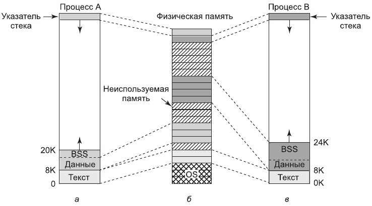
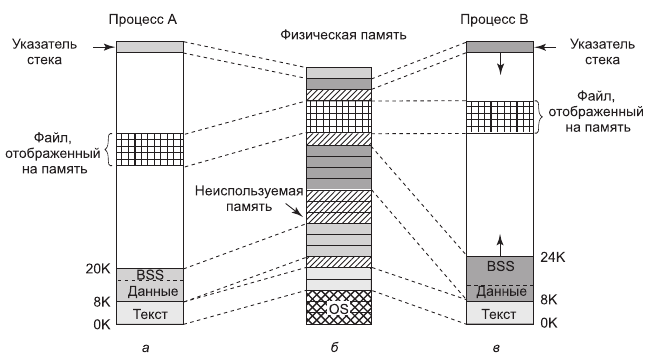
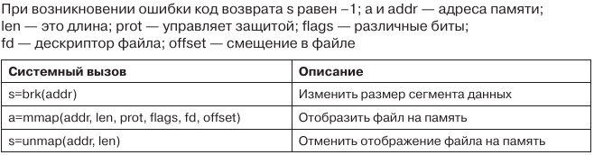
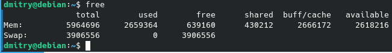

# 4. Управление памятью в Linux

Используемая в Linux модель памяти довольно проста, что должно обеспечить переносимость программ, а также реализацию операционной системы Linux на машинах с сильно различающимися блоками управления памятью, варьирующимися от элементарных (например, оригинальная IBM PC) до сложного оборудования со страничной организацией. Эта область практически не изменилась за последние несколько десятков лет. Разработанные решения хорошо себя зарекомендовали и не требовали серьезной переработки.

## Фундаментальные концепции

У каждого процесса в системе Linux есть адресное пространство, состоящее из трех логических сегментов: текста, данных и стека. **Текстовый сегмент** (text segment) содержит машинные команды, образующие исполняемый код программы. Он создается компилятором
и ассемблером при трансляции программы (написанной на языке высокого уровня, например C или C++) в машинный код. Как правило, текстовый сегмент доступен только для чтения. Самомодифицирующиеся программы вышли из моды примерно в 1950 году, так как их было слишком сложно понимать и отлаживать. Таким образом, не изменяются ни размеры, ни содержание текстового сегмента.

**Сегмент данных** (data segment) содержит переменные, строки, массивы и другие данные программы. Он состоит из двух частей: инициализированных и неинициализированных данных. По историческим причинам вторая часть называется BSS (Block Started by Symbol). Инициализированная часть сегмента данных содержит переменные и константы компилятора, значения которых должны быть заданы при запуске программы. Все переменные в BSS должны быть инициализированы в нуль после загрузки.

Например, на языке C можно объявить символьную строку и в то же время проинициализировать ее. Если программа запускается, она предполагает, что эта строка уже имеет свое начальное значение. Чтобы реализовать это, компилятор назначает строке определенное место в адресном пространстве и гарантирует, что в момент запуска программы по этому адресу будет располагаться необходимая строка. С точки зрения операционной системы инициализированные данные не отличаются от текста программы - и тот и другой сегменты содержат сформированные компилятором последовательности битов, которые должны быть загружены в память при запуске программы.

Неинициализированные данные необходимы лишь с точки зрения оптимизации. Если глобальная переменная не инициализирована явным образом, то, согласно семантике языка C, ее начальное значение устанавливается равным 0. На практике большинство глобальных переменных не инициализируются, таким образом, их начальное значение равно 0. Это можно реализовать следующим образом: создать область исполняемого двоичного файла, точно равную по размеру числу байтов данных, и проинициализировать всю эту область нулями.

Рассмотрим пример на рисунке 1 (а). Здесь текст программы занимает 8 Кбайт, инициализированные данные - также 8 Кбайт. Размер неинициализированных данных (BSS) равен 4 Кбайт. Исполняемый файл содержит только 16 Кбайт (текст + инициализированные данные) плюс короткий заголовок, в котором операционной системе дается указание выделить программе дополнительно 4 Кбайт (после инициализированных данных) и обнулить их перед выполнением программы. Этот трюк позволяет сэкономить 4 Кбайт нулей в исполняемом файле.

*Рисунок 1. а - виртуальное адресное пространство процесса А; б - физическая память; в - виртуальное адресное пространство процесса B*  

Для того чтобы избежать выделения полной нулей физической страницы, во время инициализации Linux выделяет статическую нулевую страницу (защищенную от записи страницу, заполненную нулями). Когда процесс загружается, указатель на область его неинициализированных данных устанавливается на эту нулевую страницу. Когда процесс пытается писать в эту область, то вмешивается механизм копирования при записи и процессу выделяется настоящая страница.

В отличие от текстового сегмента, который не может изменяться, сегмент данных изменяться может. Программы все время модифицируют свои переменные. Более того, многим программам требуется динамическое выделение памяти во время выполнения. Для этого операционная система Linux разрешает сегменту данных расти при выделении памяти и уменьшаться при освобождении памяти. Программа может установить размер своего сегмента данных при помощи системного вызова **brk**. Таким образом, чтобы выделить больше памяти, программа может увеличить размер своего сегмента данных. Этим системным вызовом активно пользуется библиотечная процедура **malloc** языка С, используемая для выделения памяти. Дескриптор адресного пространства процесса содержит информацию о диапазоне динамически выделенных областей памяти процесса (который обычно называется **кучей** - *heap*).

Третий сегмент - это **сегмент стека** (stack segment). На большинстве компьютеров он начинается около старших адресов виртуального адресного пространства и растет вниз к 0. Например, на 32-битной платформе х86 стек начинается с адреса 0xC0000000, который соответствует предельному виртуальному адресу, видимому процессам пользовательского режима. Если указатель стека оказывается ниже нижней границы сегмента стека, то происходит аппаратное прерывание, при котором операционная система понижает границу сегмента стека на одну страницу. Программы не управляют явно размером сегмента стека.

Когда программа запускается, ее стек не пуст. Напротив, он содержит все переменные окружения (оболочки), а также командную строку, введенную в оболочке для вызова этой программы. Таким образом, программа может узнать параметры, с которыми она была запущена. Например, когда вводится команда

	cp src dest

то запускается программа *cp* со строкой *cp src dest* в стеке, что позволяет ей определить имена файлов, с которыми ей предстоит работать. Строка представляется в виде массива указателей на символы строки, что облегчает ее разбор.

Когда два пользователя запускают одну и ту же программу (например, текстовый редактор), то в памяти можно было бы хранить две копии программы редактора. Однако такой подход неэффективен. Вместо этого большинством систем Linux поддерживаются **текстовые сегменты совместного использования** (shared text segemts).
На *рис. 1, а* и *в* мы видим два процесса, A и B, совместно использующие общий текстовый сегмент. На *рис. 1, б* мы видим возможную компоновку физической памяти, где оба процесса совместно используют один и тот же фрагмент текста. Отображение выполняется аппаратным обеспечением виртуальной памяти.

Сегменты данных и стека никогда не бывают общими, кроме как после выполнения системного вызова *fork*, и то только те страницы, которые не модифицируются. Если размер одного из сегментов должен быть увеличен, то отсутствие свободного места в соседних страницах памяти не является проблемой, поскольку соседние виртуальные страницы памяти не обязаны отображаться на соседние физические страницы.

В дополнение к динамическому выделению памяти процессы в Linux могут обращаться к данным файлов при помощи **отображения файлов на адресное пространство памяти** (memory-mapped files). Эта функция позволяет отображать файл на часть адресного пространства процесса, чтобы можно было читать из файла и писать в файл так, как если бы это был массив байтов, хранящийся в памяти. Отображение файла на адресное пространство памяти делает произвольный доступ к нему существенно более легким, нежели при использовании таких системных вызовов, как *read* и *write*. Совместный доступ к библиотекам предоставляется именно при помощи этого механизма. На рис. 2 показан файл, одновременно отображенный на адресные пространства двух процессов по различным виртуальным адресам.

*Рисунок 2. Два процесса совместно используют один отображенный на память файл*  

## Системные вызовы управления памятью в Linux

Стандарт POSIX не определяет системные вызовы для управления памятью. Эту область посчитали слишком машинно зависимой, чтобы ее стандартизировать. Вместо этого просто сделали вид, что проблемы не существует, и заявили, что программы, которым требуется динамическое управление памятью, могут использовать библиотечную процедуру *malloc* (определенную стандартом ANSI C). Таким образом, вопрос реализации процедуры *malloc* был вынесен за пределы стандарта POSIX. В некоторых кругах такой подход считают перекладыванием бремени решения проблемы на чужие плечи.

На практике в большинстве систем Linux есть системные вызовы для управления памятью. Наиболее распространенные системные вызовы перечислены в табл. 1. Системный вызов **brk** указывает размер сегмента данных, задавая адрес первого байта за его пределами. Если новое значение больше старого, то сегмент данных увеличивается, в противном случае он уменьшается.

*Таблица 1. Некоторые системные вызовы для управления памятью*

Системные вызовы **mmap** и **unmap** управляют отображением файлов на адресное пространство памяти. Первый параметр *addr* системного вызова mmap указывает адрес, по которому будет отображаться файл (или его часть). Он должен быть кратен размеру страницы. Если этот параметр равен 0, то операционная система определяет этот адрес сама и возвращает его в *a*. Второй параметр - *len* - задает количество отображаемых байтов. Он также должен быть кратен размеру страницы. Третий параметр - *prot* - задает режим защиты для отображаемого файла. Файл может быть помечен как доступный для чтения, записи, исполнения (или любой комбинацией этих трех битов). Четвертый параметр - *flags* - определяет, является отображаемый файл приватным или доступным для совместного использования, а также содержит параметр *addr* жесткое требование или это всего лишь подсказка. Пятый параметр - *fd* - представляет собой дескриптор отображаемого файла. Отображаться могут только открытые файлы. Наконец, параметр *offset* сообщает, с какого места должен отображаться файл. Файл может быть отображен начиная с границы страницы.

Второй системный вызов - **unmap** - отменяет отображение файла на память. Если отменяется отображение только части файла, то остальная часть файла продолжает отображаться на память.

## Реализация управления памятью в Linux

Каждый процесс системы Linux на 32-разрядной машине обычно получает 3 Гбайт виртуального адресного пространства для себя, а оставшийся 1 Гбайт памяти резервируется для его страничных таблиц и других данных ядра. 1 Гбайт ядра не виден в пользовательском режиме, но становится доступным, когда процесс переключается в режим ядра. Память ядра обычно находится в нижних физических адресах, но отображается в верхний гигабайт виртуального адресного пространства процесса (между адресами 0xC0000000 и 0xFFFFFFFF, это диапазон от 3 до 4 Гбайт). На ныне существующих 64-разрядных машинах семейства x86 для адресации используется не более 48 бит, следовательно, для адресуемой памяти существует теоретический лимит размером 256 Тбайт. Linux разделяет эту память между ядром и пространством пользователя, что дает каждому процессу максимальное виртуальное пространство объемом 128 Тбайт. Адресное пространство создается при инициализации процесса и переписывается с помощью системного вызова *exec*.

Чтобы несколько процессов могли совместно использовать физическую память, Linux отслеживает использование физической памяти, выделяет при необходимости дополнительную память пользовательским процессам и компонентам ядра, динамически отображает области физической памяти на адресное пространство разных процессов, а также динамически доставляет в память и убирает из нее исполняемые программы, файлы и прочую информацию состояния (по мере необходимости) - чтобы эффективно использовать ресурсы платформы и обеспечить продвижение процесса выполнения.

## Подкачка в Linux

В ранних системах UNIX использовался *процесс подкачки* (swapper process), который перемещал процессы целиком между памятью и диском (когда все активные процессы не помещались в физической памяти). Linux (подобно другим современным версиям UNIX) больше не перемещает процессы целиком. Единицей управления памятью является страница, и почти все компоненты управления памятью работают с точностью до страниц.

Основная идея подкачки в Linux проста: процессу не обязательно находиться целиком в памяти для того, чтобы выполняться. Все, что нужно, — это пользовательская структура и таблицы страниц. Если они подкачаны в память, то процесс считается находящимся в памяти и может планироваться для выполнения. Страницы сегментов текста, данных и стека подкачиваются динамически (по одной) по мере появления ссылок на них. Если пользовательская структура и таблица страниц не находятся в памяти, то процесс не может выполняться до тех пор, пока процесс подкачки не доставит их в память.

Подкачка реализована частично ядром, а частично новым процессом, называемым **демоном страниц** (page daemon). Демон страниц — это процесс 2 (процесс 0 — это процесс *idle*, традиционно называемый своппером, а процесс 1 — это *init*). Как и все демоны, демон страниц работает периодически. После пробуждения он осматривается, есть ли для него работа. Если он видит, что количество страниц в списке свободных слишком мало, то он начинает освобождать страницы.

Операционная система Linux является системой с подкачкой страниц по требованию (без упреждающей подкачки) и без концепции рабочего набора. Текстовые сегменты и отображаемые на адресное пространство памяти файлы подгружаются из соответствующих им файлов на диске. Все остальное выгружается либо в раздел подкачки (если он присутствует), либо в один из файлов подкачки (фиксированной длины), которые называются **областью подкачки** (swap area). Файлы подкачки могут динамически добавляться и удаляться, и у каждого есть свой приоритет. Подкачка страниц из отдельного раздела диска, доступ к которому осуществляется как к отдельному устройству, не содержащему файловой системы, более эффективна, чем подкачка из файла, по нескольким причинам. Во-первых, не требуется отображение блоков файла в блоки диска. Во-вторых, физическая запись может иметь любой размер, а не только размер блока файла. В-третьих, страница всегда пишется на диск в виде единого непрерывного участка, а при записи в файл подкачки это может быть и не так.

Страницы на устройстве подкачки или разделе подкачки не выделяются до тех пор, пока они не потребуются. Каждое устройство или файл подкачки начинается с битового массива, в котором сообщается, какие страницы свободны. Когда страница, у которой нет резервного хранения на диске, должна быть удалена из памяти, то из разделов (или файлов) подкачки, в которых еще есть свободное место, выбирается раздел (или файл) с наивысшим приоритетом и в нем выделяется страница. Как правило, раздел подкачки (если таковой имеется) имеет более высокий приоритет, чем любой файл подкачки. Таблица страниц обновляется, чтобы отразить тот факт, что страница больше не присутствует в памяти (то есть устанавливается бит «страница отсутствует»), и ее местоположение на диске записывается в элемент таблицы страниц.

Таким образом, каждый процесс в системе Linux имеет адресное пространство, состоящее из трех логических сегментов: текстовый сегмент, сегмент данных и сегмент стека. Для обеспечения эффективного использования разными пользователями одной программы используются текстовые сегменты совместного использования. Процессы могут обращаться к файлам с помощью механизма отображения файлов на адресное пространство памяти. Чтобы несколько процессов могли совместно использовать физическую память, Linux отслеживает использование физической памяти, выделяет при необходимости дополнительную память пользовательским процессам и компонентам ядра, динамически отображает области физической памяти на адресное пространство разных процессов, а также динамически доставляет в память и убирает из нее исполняемые программы, файлы и прочую информацию состояния (по мере необходимости) - чтобы эффективно использовать ресурсы платформы и обеспечить продвижение процесса выполнения. Также Linux использует подкачку для обеспечения работоспособности системы в условиях ее высокой загруженности и нехватки физической памяти. Старые и/или невостребованные страницы вытесняются в файл или раздел подкачки, а затем извлекаются оттуда при необходимости.

## Работа с памятью

Для работы с памятью существуют несколько утилит, одной из которой является консольная программа **free** - простая утилита, которая выводит информацию об общем количестве физической памяти, о количестве занятой и свободной памяти, а также об использовании подкачки.

Другими утилитами являются упомянутые в прошлом файле программы **top** и **htop**, которые, помимо информации о процессе, выводят также информацию об использовании оперативной памяти.

В следующем файле будет рассмотрен ввод-вывод в системах Linux. Тест по теме управления памятью в Linux доступен в файле `4.lle`
