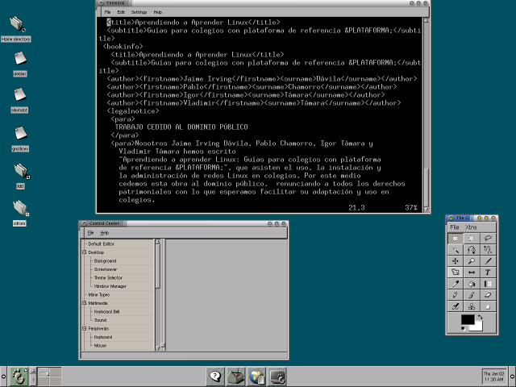
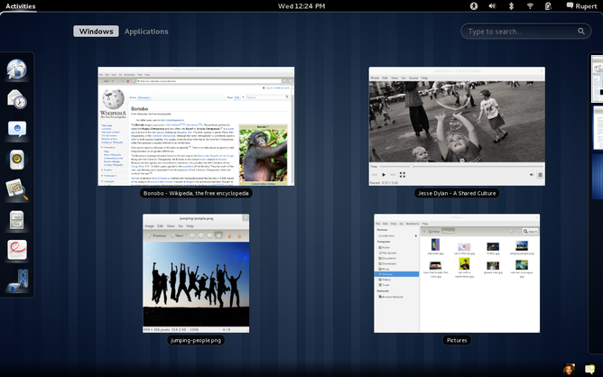
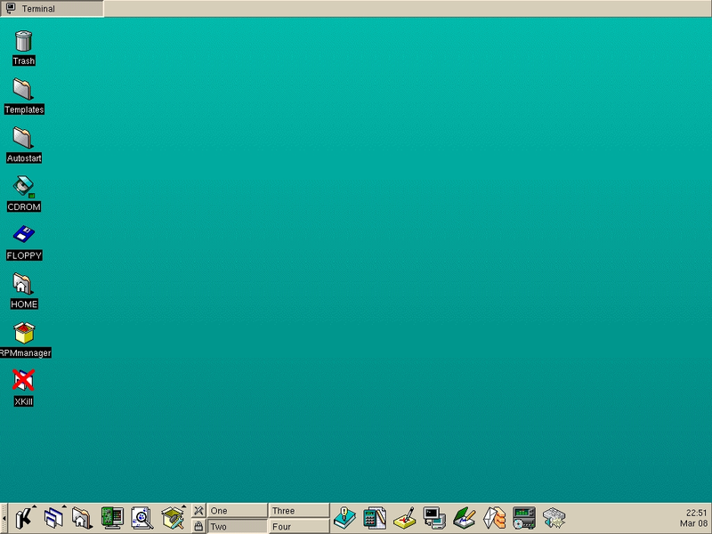
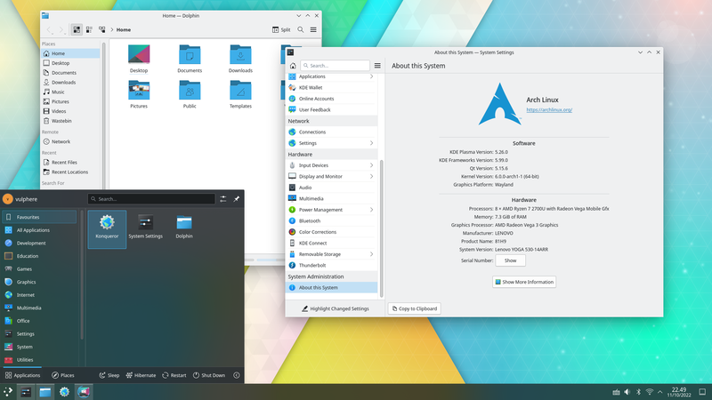
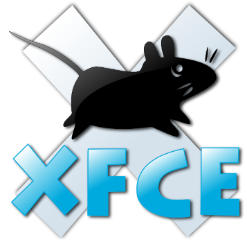
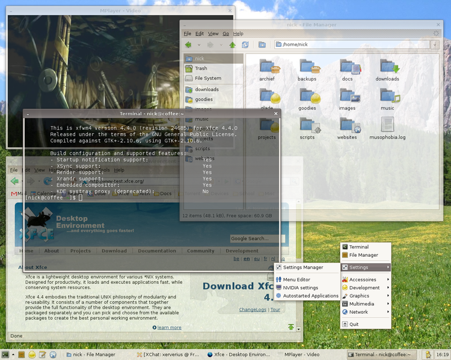

# 1. Linux
## Общие сведения
Linux - ядро операционной системы, соответствующее стандартам POSIX, составляющее основу операционных систем семейства Linux, а также ряда операционных систем для мобильных устройств, в том числе Android, Tizen, KaiOS. Разработка кода ядра была начата финским студентом Линусом Торвальдсом в 1991 году, на его имя зарегистрирована торговая марка «Linux».

Код написан в основном на Си с некоторыми расширениями gcc и на ассемблере (с использованием AT&T-синтаксиса GNU Assembler).

Распространяется как свободное программное обеспечение на условиях GNU General Public License, кроме несвободных элементов, особенно драйверов, которые используют прошивки, распространяемые под различными лицензиями.

Операционные системы на базе ядра Linux являются лидерами на рынках суперкомпьютеров, микрокомпьютеров, серверов и смартфонов.

Начало проекту было положено в 1991 году с публикации сообщения в новостной группе Usenet. К тому времени GNU уже создал множество составляющих для свободной операционной системы, однако проект по созданию ядра системы GNU Hurd оказался неудачным. Поэтому пустующее место ядра для свободной операционной системы занял Linux и, несмотря на ограниченную функциональность ранних версий, привлёк к себе множество разработчиков и пользователей.

Исходные коды ядра Linux доступны в открытом доступе на сайте kernel.org.

Логотипом Linux стал пингвин Tux, нарисованный в 1996 году программистом и дизайнером Ларри Юингом.

Linux стал популярен по следующим причинам:
- актуальность дистрибутивов и активная поддержка сообществами разработчиков;
- работоспособность системы на самом разном оборудовании;
- низкие системные требования;
- возможность установки программ из единых хранилищ программного обеспечения (репозиториев).

Кроме того, большинство дистрибутивов GNU/Linux поставляются с большим количеством средств разработки программного обеспечения. Именно поэтому Linux так популярен у разработчиков.

Существуют не только практические, но и этические причины популярности Linux: многие пользователи и разработчики воспринимают Linux как выражение открытости, самовыражения и доступности.

Таким образом, Linux является ядром Unix-подобной операционной системы, выполняющим низкоуровневые функции, а большая часть программного обеспечения для работы с ядром предоставляется проектом GNU.

В следующем разделе будут рассмотрены понятие дистрибутива GNU/Linux и их классификация.

# Дистрибутивы GNU/Linux
Открытость проекта и активное участие сообщества в разработке породило большое количество **дистрибутивов**. Дистрибутив (distribution, от англ. distribute - распространять) - форма распространения программного обеспечения. Дистрибутив GNU/Linux представляет собой готовую операционную систему, включающую в себя ядро Linux, программное обеспечение GNU, а также другое ПО, созданное разработчиком дистрибутива или другими участниками сообщества.

В настоящее время существует более шестисот дистрибутивов GNU/Linux; более половины из них поддерживаются в актуальном состоянии, что обеспечивается регулярным выпуском обновлений разработчиками дистрибутива.

Несмотря на столь большое количество дистрибутивов, все они сводятся к 3 группам.  
Классификация по способу поддержки и обновления операционной системы:
- **LTS дистрибутивы** (от англ. Long Term Support - долгосрочная поддержка) - предоставляют строгий график выхода стабильных версий системы (например, каждые 5 лет). Новые пакеты программного обеспечения, а также новые версии старых пакетов попадают только в готовящийся (*нестабильный*) релиз, а пакеты текущего (*стабильного*) релиза обновляются только при исправлении обнаруженных уязвимостей или других проблем безопасности. Преимуществом такого подхода является стабильность системы, так как в стабильном релизе содержатся только пакеты, прошедшие проверку временем. Недостаток - устаревание версий пакетов с течением времени до перехода нестабильного релиза в стабильный;
- **Rolling дистрибутивы** (от англ. Rolling release - плавающий релиз, буквально - "катящийся" релиз) - являются полной противоположностью LTS-дистрибутивов. При таком подходе отсутствует четкое деление на версии системы, а новые пакеты ПО попадают в репозиторий системы сразу после выхода. Главное преимущество такого метода дистрибуции - постоянная поддержка пакетов в актуальном состоянии и возможность "обкатки" новых технологий в операционой системе. Недостатком же является возможная нестабильность и сбои в работе системы ввиду отсутствия предварительного тестирования программного обеспечения;
- **Middle-rolling дистрибутивы** ("полуроллинги") - дистрибутивы, разработчики которых стараются поддерживать баланс между стабильностью системы и новизной пакетов.

В следующем разделе будут рассмотрены программное обеспечение GNU и используемые в системах GNU/Linux среды рабочего стола.

# Программное обеспечение GNU. Среды рабочего стола
## Программное обеспечение GNU.
GNU (от англ. GNU’s Not Unix - "GNU - не Unix") - свободная UNIX-подобная операционная система, разрабатываемая проектом GNU. Как уже упоминалось, GNU использует Linux в качестве ядра для системы, тем самым, формируя операционную систему GNU/Linux, более известную как просто Linux. Проект GNU предоставляет большое количество программного обеспечения для работы с ядром.

GNU включает в себя следующее программное обеспечение:
- **libc** (C Library - библиотека Си) - предоставляет библиотеку, работающую с ядром, для написания прикладного ПО на языке C для систем GNU и GNU/Linux. Этот проект обеспечивает совместимость указанных систем со стандартами POSIX. API предоставляет такие фундаментальные функции, как `open`, `read`, `write`, `malloc`, `printf`, `pthread_create`, `exit` и многие другие;
- **grub** (от англ. GRand Unified Bootloader - великий унифицированный загрузчик) - загрузчик операционной системы. Позволяет пользователю иметь несколько установленных операционных систем и при включении компьютера выбирать одну из них для загрузки. Может передавать управление другим загрузчикам, например Windows Boot Manager;
- **gcc** (от англ. Gnu Compiler Collection - набор компиляторов GNU) - набор компиляторов для различных языков программирования. Используется как стандартный компилятор для свободных UNIX-подобных операционных систем. Первоначально названный GNU C Compiler, он поддерживал только язык C. Позднее был расширен для компиляции исходных кодов на C++, Objective-C, Java, Fortran, Ada, Go, GAS и D;
- **make** (от англ. make - делать, создавать) - инструмент для сборки исполнительных файлов из скомпилированных исходных кодов;
- **bash** (от англ. Born Again SHell - "возрожденный/перерожденный" shell) - усовершенствованная и модернизированная вариация командной оболочки *Bourne shell*. Одна из наиболее популярных современных разновидностей командной оболочки UNIX, особенно в системах GNU/Linux, где она часто используется в качестве предустановленной командной оболочки. Bash также соответствует стандарту POSIX, но с рядом расширений.

Кроме перечисленного программного обеспечения существует большое количество других проектов (всего около 350 без учета более не поддерживаемых).

Далее рассмотрены понятие среды рабочего стола и основные используемые среды рабочего стола в GNU/Linux.

## Среды рабочего стола.

В любой операционной системе, имеющей графический интерфейс, последний всегда запускается в качестве отдельного процесса в пользовательском пространстве. В системах GNU/Linux, в отличие от Windows, это выражается явным образом - пользователь имеет возможность выбирать среду рабочего стола при установке системы или даже установить несколько сразу и выбирать загружаемую оболочку при запуске операционной системы.

**Среда рабочего стола** (англ. DE - desktop environment; так же может называться окружением рабочего стола, рабочим окружением, графической оболочкой) - разновидность графических интерфейсов пользователя, основанная на *метафоре рабочего стола*. Среду рабочего стола так же называют *графической оболочкой* (хотя с технической точки зрения это не совсем верно). В UNIX-подобных операционных системах СРС запускается в **X Window System** - оконной системе, обеспечивающей стандартные инструменты и протоколы для построения графического интерфейса пользователя. В начале 2020-х годов графические интерфейсы стали переходить на новую оконную систему - **Wayland**. Однако данная система все еще является экспериментальной, и в большинстве дистрибутивов все еще используется X Window System (или просто X).

Крупные среды рабочего стола, как правило, включают в свой состав *менеджер дисплеев* и *оконный менеджер*. Тем не менее, пользователь имеет возможность другой менеджер дисплеев. Более мелкие же проекты содержат только оконный менеджер, при этом используется сторонний менеджер дисплеев.

Рассмотрим основные существующие среды рабочего стола:
### GNOME
**GNOME** (от англ. GNU Network Object Model Environment - среда сетевой объектной модели GNU). Несмотря на название, данная СРС не является частью проекта GNU, а под GNU в данном случае подразумевается операционная система. Является одной из самых популярных СРС не только в системах GNU/Linux, но и во всех UNIX-подобных системах.

Разработчики GNOME ориентируются на создание полностью свободной среды, доступной всем пользователям вне зависимости от их уровня технических навыков, физических ограничений и языка, на котором они говорят. В рамках проекта GNOME разрабатываются как приложения для конечных пользователей, так и набор инструментов для создания новых приложений, тесно интегрируемых в рабочую среду.

GNOME использует **GTK** (ранее GTK+; сокращение от GIMP ToolKit) - кроссплатформенную библиотеку элементов интерфейса (фреймворк).

#### Версии

Новые версии GNOME выходят 2 раза в год - в марте и в сентябре. Стабильные выпуски имеют четные младшие номера версии (2.0, 2.2, 2.4 и т. д.), а версии в разработке - нечетные.

Первая стабильная версия GNOME (1.0) вышла 3 марта 1999 года.

  
*Внешний вид GNOME 1*

Версия 2.0 была выпущена 26 июня 2002 года и включала в себя существенное усовершенствование - переход на *GTK+ версии 2.0*.

  
*Внешний вид GNOME 2*

Следующее крупное обновление состоялось 6 апреля 2011 года (версия 3.0) - переход на GTK+ 3. Использование оболочки GNOME Shell и оконного менеджера Mutter по умолчанию. Интеграция мгновенного обмена сообщениями в оболочку. Однооконный интерфейс Центра управления. Новая тема Adwaita по умолчанию. Новый внешний вид системных диалогов и уведомлений. Переход на систему настроек GSettings. Крупные обновления многих стандартных приложений, в том числе Nautilus, Gedit, Evince, Yelp и Cheese.

GNOME версии 3 существенно изменил внешний вид. Оболочка была адаптирована под ее использование на устройствах с сенсорными экранами, а общий вид интерфейса стал абсолютно новым, не похожим ни на один интерфейс из ранее существовавших. За столь существенные изменения новый GNOME получил крайне противоречивые отзывы от сообщества. Линус Торвальдс также критически оценил третью версию GNOME, отметил ряд недостатков и предложил создать *ответвление (форк)* GNOME 2 (одним из которых стал *MATE*).

  
*Внешний вид GNOME 3*

Несмотря на всю критику от сообщества, GNOME сохранил лидирующие позиции в популярности рабочих окружений в UNIX-подобных операционных системах. GNOME является передовой средой рабочего стола и активнее всех остальных внедряет новые технологии. Во многих дистрибутивах GNU/Linux он является рабочим *окружением по умолчанию*, а на момент начала 2023 года в Rolling и Middle-rolling дистрибутивах он по умолчанию поставляется вместе с оконной системой *Wayland*.

### KDE Plasma

**KDE Plasma** является второй по популярности средой рабочего стола после GNOME. До начала 2010 года название KDE обозначало среду рабочего стола(сокращение от K Desktop Environment; при первоначальной разработке использовалось название Kool Desktop Environment затем слово Kool было убрано, и осталось просто K), а с 2010 года под ним понимается *сообщество*, разрабатывающее KDE Plasma.

Начиная с 2010 года, проект KDE разделился на 3 части:
- **KDE Plasma** - интерфейс платформы для различных рабочих областей. Существует несколько проектов, связанных с KDE Plasma: Plasma Desktop для настольных компьютеров и ноутбуков, Plasma Mobile для смартфонов, Plasma Minishell для встроенных и сенсорных устройств и Plasma Media Center для телевизоров;
- **KDE Frameworks** - коллекция из более чем 70 бесплатных и открытых библиотек, построенных поверх **Qt** - фрейморка для разработки графических интерфейсов (аналог *GTK*);
- **KDE Applications** - набор приложений и вспомогательных библиотек, состоящий более чем из 100 приложений. В этот набор входят такие приложения, как файловый менеджер *Dolphin*, текстовый редактор *Kate*, эмулятор терминала *Konsole* и др. В названиях многих приложений намеренно допущены орфографические ошибки, которые выступают в роли стилистики проекта (например, konsole вместо console, konversation вместо conversation и т. д.).

Первая версия K Desktop Environment вышла 12 июля 1998 года.

  
*Первая версия KDE*

Текущей версией KDE Plasma является *версия 5*.

  
*KDE Plasma версии 5*

KDE Plasma 5 по умолчанию гораздо больше похожа на интерфейс Windows, чем GNOME 3. Тем не менее, она является очень гибкой средой.

## Xfce

GNOME и KDE Plasma являются современными и передовыми рабочими окружениями. В связи с этим они имеют очень высокие системные требования, которым не соответствуют старые компьютеры. Для возможности использования современных систем семейства GNU/Linux на устаревшем "железе" требуются легковесные окружения рабочего стола. Одним из самых популярных таких рабочих окружений является **Xfce**, основанный на GTK+. Xfce воплощает в себе *традиционную философию UNIX*, например, концепцию модульности (функциональные компоненты вынесены в отдельные приложения).

  
*Xfce версии 4*

### Другие окружения рабочего стола

Ранее были перечислены самые популярные рабочие окружения. Далее кратко рассмотрим другие используемые оболочки:
- Cinnamon (от англ. cinnamon - корица) является ответвлением GNOME 2. Данная оболочка разрабатывается с целью быть похожей на интерфейс Windows для упрощения перехода новых пользователей с указанной системы;
- MATE (от исп. mate - вид падуба, растения, из листьев которого готовят одноименный напиток) - другое ответвление GNOME 2, сохранившее внешний вид интерфейса из GNOME 2;
- LXDE (от англ. Lightweight X11 Desktop Environment - легковесное окружение рабочего стола X11) - легковесное рабочее окружение для использования на старых компьютерах.

Помимо перечисленных окружений рабочего стола существуют и многие другие.

В следующем файле будут рассмотрены конкретные дистрибутивы GNU/Linux и их направления (ветки). Тест по теме общих сведений по Linux доступен в файле `1.lle`.
