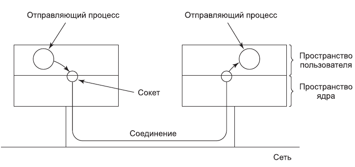
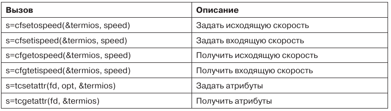

# 5. Ввод-вывод в системах Linux

Система ввода-вывода в Linux довольно проста и не отличается от присущих другим UNIX-системам. Как правило, все устройства ввода-вывода выглядят как файлы и доступ к ним осуществляется с помощью тех же системных вызовов *read* и *write*, которые используются для доступа ко всем обычным файлам. В некоторых случаях должны быть заданы параметры устройства - это делается при помощи специального системного вызова

## Фундаментальные концепции

Как и у всех компьютеров, у работающих под управлением операционной системы Linux машин есть подключенные к ним устройства ввода-вывода (такие, как диски, принтеры и сети). Требуется некий способ предоставления программам доступа к этим устройствам. Хотя возможны различные варианты решения данного вопроса, применяемый в операционной системе Linux подход заключается в интегрировании всех устройств в файловую систему в виде так называемых **специальных файлов** (special files). Каждому устройству ввода-вывода назначается маршрут (обычно в каталоге /dev). Например, диск может иметь маршрут /dev/hd1, у принтера может быть маршрут /dev/lp, а у сети — /dev/net.

Доступ к этим специальным файлам осуществляется так же, как и к любым другим файлам. Для этого не требуется никаких специальных команд или системных вызовов. Вполне подойдут обычные системные вызовы **read** и **write**. Например, команда

	cp file /dev/lp
	
скопирует файл *file* на принтер, в результате чего этот файл будет распечатан (при условии, что у пользователя есть разрешение на доступ к /dev/lp). Программы могут открывать и читать специальные файлы, а также писать в них (тем же способом, что и в обычные файлы). На самом деле программа cp в приведенном выше примере даже не знает, что она делает вывод на печать. Таким образом, для выполнения ввода-вывода не требуется специального механизма.

Специальные файлы подразделяются на две категории: блочные и символьные. **Блочный специальный файл** (block special file) состоит из последовательности пронумерованных блоков. Основное свойство блочного специального файла заключается в том, что к каждому его блоку можно адресоваться и получить доступ отдельно. Иначе говоря, программа может открыть блочный специальный файл и прочитать, скажем, 124-й блок (и для этого не надо читать сначала блоки с 0-го по 123-й). Блочные специальные файлы обычно используются для дисков.

**Символьные специальные файлы** (character special files) обычно используются для устройств ввода или вывода символьного потока. Символьные специальные файлы используются такими устройствами, как клавиатуры, принтеры, сети, мыши, плоттеры и т. д. Невозможно (и даже бессмысленно) искать на мыши 124-й блок.

С каждым специальным файлом связан драйвер устройства, осуществляющий работу с соответствующим устройством. У каждого драйвера есть так называемый номер **старшего устройства** (major device), предназначенный для его идентификации. Если драйвер одновременно поддерживает несколько устройств (например, два диска одного типа), то каждому диску присваивается идентифицирующий его номер **младшего устройства** (minor device). Вместе взятые номера главного устройства и младшего устройства однозначно определяют каждое устройство ввода-вывода. В некоторых случаях один драйвер может управлять двумя связанными устройствами. Например, соответствующий символьному специальному файлу `/dev/tty` драйвер управляет и клавиатурой, и экраном, которые часто воспринимаются как единое устройство - терминал.

### Работа с сетью

Работа с сетью впервые появилась в Berkley UNIX и была перенята Linux почти без изменений. Ключевым понятием в схеме Berkeley UNIX является **сокет** (socket). Сокеты подобны почтовым ящикам и телефонным розеткам в том смысле, что они образуют пользовательский интерфейс с сетью, как почтовые ящики формируют интерфейс с почтовой системой, а телефонные розетки позволяют абоненту подключить телефон и соединиться с телефонной системой.

*Использование сокетов для работы сети*

Сокеты могут динамически создаваться и уничтожаться. При создании сокета вызывающему процессу возвращается дескриптор файла, требующийся для установления соединения, чтения и записи данных, а также разрыва соединения.

Каждый сокет поддерживает определенный тип работы в сети, указываемый при создании сокета. Наиболее распространенными типами сокетов являются:

1. Надежный ориентированный на соединение поток байтов.
2. Надежный ориентированный на соединение поток пакетов.
3. Ненадежная передача пакетов.

Первый тип сокетов позволяет двум процессам на различных машинах установить между собой эквивалент некой трубы. Байты подаются в канал с одного конца и в том же порядке выходят с другого. Такая система гарантирует, что все посланные байты прибудут на другой конец канала, и прибудут именно в том порядке, в котором были отправлены.

Второй тип сокетов отличается от первого тем, что он сохраняет границы пакетов. Если отправитель пять раз сделал системный вызов write, каждый раз отправляя по 512 байтов, а получатель запрашивает 2560 байтов, то при типе сокета 1 он получит все 2560 байтов сразу. При использовании сокета типа 2 ему будут выданы только первые 512 байтов. Чтобы получить остальные байты, получателю придется выполнить системный вызов read еще четыре раза. Третий тип сокета предоставляет пользователю доступ к «голой» сети. Этот тип сокета особенно полезен для приложений реального времени и для тех ситуаций, в которых пользователь хочет реализовать специальную схему обработки ошибок. Сеть может терять пакеты или доставлять их в неверном порядке. В отличие от сокетов первых двух типов, сокет типа 3 не предоставляет никаких гарантий. Преимущество этого режима заключается в более высокой производительности, что иногда важнее надежности. Такой режим используют программы, в которых скорость доставки данных ценится существенно выше, чем их сохранность, например, системы аудио- и видеосвязи, онлайн-игры и др.

При создании сокета один из параметров указывает используемый для него протокол. Для надежных байтовых потоков, как правило, используется протокол **TCP** (Transmission Control Protocol - протокол управления передачей). Для ненадежной передачи пакетов обычно применяется протокол **UDP** (User Data Protocol - пользовательский протокол данных). Оба они работают поверх протокола **IP** (Internet Protocol). Все эти протоколы были разработаны для сети ARPANET Министерства обороны США и теперь составляют основу Интернета. Для надежного потока пакетов общепринятого протокола нет.

Прежде чем сокет может быть использован для работы в сети, с ним должен быть связан адрес. Этот адрес может принадлежать к одному из нескольких пространств адресов. Наиболее распространенным пространством является пространство адресов Интернета, использующее 32-разрядные целые числа (для идентификации конечных адресатов) в протоколе IPv4 и 128-разрядные целые числа в протоколе IPv6 (5-я версия протокола IP была экспериментальной системой, так и не выпущенной в свет).

Как только сокеты созданы на компьютере-источнике и компьютере-приемнике, между ними может быть установлено соединение (для ориентированного на соединение обмена). Одна сторона делает системный вызов **listen**, указывая в качестве параметра локальный сокет (при этом системный вызов создает буфер и блокируется до тех пор, пока не прибудут данные). Другая сторона делает системный вызов **connect**, задавая в параметрах дескриптор файла для локального сокета и адрес удаленного сокета. Если удаленный компьютер принимает вызов, то система устанавливает соединение между двумя сокетами.

После установления соединения оно работает аналогично каналу. Процесс может читать из канала и писать в него, используя дескриптор файла для своего локального сокета. Когда соединение более не нужно, оно может быть закрыто обычным способом — при помощи системного вызова **close**.

## Системные вызовы ввода-вывода в Linux

С каждым устройством ввода-вывода в операционной системе Linux обычно связан специальный файл. Большую часть операций ввода-вывода можно выполнить при помощи соответствующего файла, что позволяет избежать необходимости использования специальных системных вызовов. Тем не менее иногда возникает необходимость в обращении к неким специфическим устройствам. До принятия стандарта POSIX в большинстве версий систем UNIX был системный вызов **ioctl**, выполнявший со специальными файлами большое количество операций, специфических для различных устройств. С течением времени все это привело к путанице. В стандарте POSIX здесь был наведен порядок, для чего функции системного вызова ioctl были разбиты на отдельные функциональные вызовы, главным образом для управления терминалом. В системе Linux и современных UNIX-системах только от конкретной реализации зависит, является ли каждый из них отдельным системным вызовом или они все вместе используют один системный вызов.

Основные системные вызовы перечислены в таблице 1. Они используются для установки и определения скорости терминала.

*Основные системные вызовы стандарта POSIX для управления терминалом*  

Последние два системных вызова в списке предназначены для установки и считывания всех специальных символов, используемых для стирания символов и строк, прерывания процессов и т. д. Помимо этого, они позволяют разрешить и запретить вывод эха, осуществлять управление потоком, а также выполнять другие связанные с символьным вводом-выводом функции. Существуют также дополнительные функциональные вызовы ввода-вывода, но они несколько специализированные. Следует также отметить, что системный вызов *ioctl* по-прежнему существует.

## Реализация ввода-вывода в Linux

Ввод-вывод в операционной системе Linux реализуется набором **драйверов устройств**, по одному для каждого типа устройств. Функция драйвера заключается в изолировании остальной части системы от особенностей аппаратного обеспечения. При помощи стандартных интерфейсов между драйверами и остальной операционной системой основная часть системы ввода-вывода может быть помещена в машинно независимую часть ядра.

Когда пользователь обращается к специальному файлу, файловая система определяет номера старшего и младшего устройств, а также выясняет, является файл блочным специальным файлом или символьным специальным файлом. Номер старшего устройства используется в качестве индекса для одной из двух внутренних хэш-таблиц, содержащих структуры данных для блочных (или символьных) специальных файлов. Найденная таким образом структура содержит указатели на процедуры открытия устройства, чтения из устройства, записи на устройство и т. д. Номер младшего устройства передается в виде параметра. Добавление нового типа устройства в системе Linux означает добавление нового элемента к одной из этих таблиц, а также предоставление соответствующих процедур выполнения различных операций с устройством.

Каждый драйвер разделен на *две части*, причем обе они являются частью ядра Linux и работают в режиме ядра. Верхняя часть драйвера работает в контексте вызывающей стороны и служит интерфейсом к остальной системе Linux. Нижняя часть работает в контексте ядра и взаимодействует с устройством. Драйверам разрешается делать вызовы процедур ядра для выделения памяти, управления таймером, управления DMA и т. д. Набор функций ядра, которые они могут вызывать, определен в документе под названием «Интерфейс драйвер — ядро» (Driver-Kernel Interface).

## Модули ядра Linux

В течение десятилетий драйверы устройств в UNIX статически компоновались в ядро, так что все они постоянно находились в памяти при каждой загрузке системы. Такая схема хорошо работала в условиях мало меняющихся конфигураций факультетских мини-компьютеров, а затем и сложных рабочих станций, то есть в тех условиях, в которых росла и развивалась операционная система UNIX. Как правило, компьютерный центр собирал ядро операционной системы (содержащее драйверы для всех необходимых устройств ввода-вывода), которым потом и пользовался. Если на следующий год покупался новый диск, то компьютерный центр пересобирал ядро, что было не так уж сложно.

Все изменилось с появлением системы Linux, ориентированной на персональные компьютеры. Количество всевозможных устройств ввода-вывода у персональных компьютеров на порядок больше, чем у мини-компьютеров. Кроме того, хотя у пользователей системы Linux есть (или они легко могут его получить) полный набор исходных кодов операционной системы, подавляющее большинство пользователей будут испытывать существенные трудности с добавлением нового драйвера, обновлением всех связанных с драйвером структур данных, пересборкой ядра и установкой его как загружаемой системы (не говоря уже о последствиях, которые возникнут в том случае, когда собранное новое ядро откажется загружаться).

В операционной системе Linux подобные проблемы были решены при помощи концепции **подгружаемых модулей** (loadable modules). Это фрагменты кода, которые могут быть загружены в ядро во время работы операционной системы. Как правило, это драйверы символьных или блочных устройств.

Помимо драйверов, многое другое программное обеспечение может быть загружено в систему в виде модуля ядра. Это могут быть файловые системы, сетевые протоколы, демоны, модули систем виртуализации (гипервизоров) и т. д.

Таким образом, в системах Linux ввод-вывод имеет представляется в форме работы с файлами. Каждое устройство имеет свой специальный файл. Специальные файлы могут быть двух типов: блочные (как правило, используются для дисков) и символьные (для клавиатур, мониторов, принтеров, сетей и др.). Для идентификации устройств в системе используются старший и младший адреса устройства. Для работы с сетью используются сокеты, которые могут динамически создаваться и уничтожаться. Сокеты делятся на несколько типов в зависимости от скорости доставки данных и предоставляемых гарантий. Ввод-вывод в Linux реализуется набором драйверов устройств. Драйвер представляет собой программное обеспечение, основной задачей которого является изолирование остальной части системы от особенностей аппаратного обеспечения. Linux предоставляет концепцию подгружаемых модулей, с помощью которой обеспечивается динамическая загрузка драйверов во время работы операционной системы, а также другого программного обеспечения.

В следующем файле будут рассмотрены файловые системы в Linux. Тест по теме ввода-вывода в системах Linux доступен в файле `5.lle`