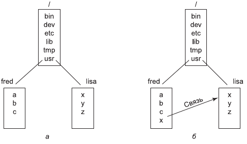
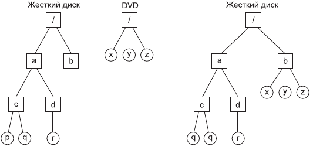
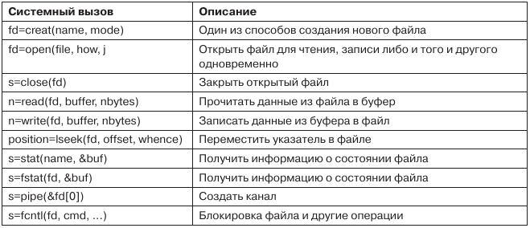
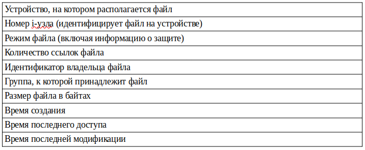

# 6. Файловые системы в Linux

## Фундаментальные концепции

Первоначально файловой системой в Linux была файловая система MINIX 1. Однако из-за того обстоятельства, что имена файлов были ограничены в ней 14 символами (чтобы поддерживать совместимость с UNIX Version 7), а максимальный размер файла составлял 64 Мбайт (что было даже слишком много для жестких дисков того времени, размер которых составлял 10 Мбайт), интерес к более совершенным файловым системам появился сразу же после начала разработки системы Linux (которая началась примерно через 5 лет после выпуска MINIX 1). Первым улучшением стала файловая система **ext**, которая позволяла использовать имена файлов длиной 255 символов и размер файлов 2 Гбайт (однако она была медленнее, чем файловая система MINIX 1, так что поиски продолжались еще некоторое время). В итоге была создана файловая система **ext2** (с длинными именами файлов, большими файлами и более высокой производительностью).

Файл в системе Linux - это последовательность байтов произвольной длины (от 0 до некоторого максимума), содержащая произвольную информацию. Не делается различия между текстовыми (ASCII) файлами, двоичными файлами и любыми другими типами файлов. Значение битов в файле целиком определяется владельцем файла. Системе это безразлично. Имена файлов ограничены 255 символами. В именах файлов разрешается использовать все ASCII-символы, кроме символа NUL, поэтому допустимо даже состоящее из трех символов возврата каретки имя файла (хотя такое имя и не слишком удобно в использовании).

По соглашению многие программы ожидают, что имена файлов будут состоять из основного имени и расширения, разделенных точкой (которая также считается символом). Так, prog.c - это обычно программа на языке C, prog.py - это обычно программа на языке Python, а prog.o - чаще всего объектный файл (выходные данные компилятора). Эти соглашения никак не регламентируются операционной системой, но некоторые компиляторы и другие программы ожидают файлов именно с такими расширениями. Расширения имеют произвольную длину, причем файлы могут иметь по несколько расширений, например prog.java.Z, что, скорее всего, представляет собой сжатую программу на языке Java.

Для удобства файлы могут группироваться в каталоги. Каталоги хранятся на диске в виде файлов, и с ними можно работать практически так же, как с файлами. Каталоги могут содержать подкаталоги, что приводит к иерархической файловой системе. Корневой каталог называется / и всегда содержит несколько подкаталогов. Символ / используется также для разделения имен каталогов, поэтому имя /usr/ast/x обозначает файл x, расположенный в каталоге ast, который в свою очередь находится в каталоге usr.

Существует два способа задания имени файла в системе Linux (как в оболочке, так и при открытии файла из программы). Первый способ заключается в использовании **абсолютного пути** (absolute path), указывающего, как найти файл от корневого каталога. Пример абсолютного пути: `/usr/ast/books/mos4/chap-10`. Он сообщает системе, что в корневом каталоге следует найти каталог *usr*, затем в нем найти каталог *ast*, который содержит каталог *books*, в котором содержится каталог *mos4*, а в нем расположен файл *chap-10*. Абсолютные имена путей часто бывают длинными и неудобными. По этой причине операционная система Linux позволяет пользователям и процессам обозначить каталог, в котором они работают в данный момент, как **рабочий каталог** (working directory). Имена путей могут указываться относительно рабочего каталога. Путь, заданный относительно рабочего каталога, называется **относительным путем** (relative path). Например, если каталог `/usr/ast/books/mos4` является рабочим каталогом, тогда команда оболочки

    cp chap-10 backup-10

имеет тот же самый эффект, что и более длинная команда

    cp /usr/ast/books/mos4/chap-10 /usr/ast/books/mos4/backup-10

Пользователям часто бывает необходимо обратиться к файлу, принадлежащему другому пользователю, или к своему файлу, расположенному в другом месте дерева файлов. Например, если два пользователя совместно используют один файл, то он будет находиться в каталоге, принадлежащем одному из них, поэтому другому пользователю для обращения к этому файлу понадобится использовать абсолютное имя пути (или изменить свой рабочий каталог). Если абсолютный путь довольно длинный, то необходимость вводить его каждый раз может весьма сильно раздражать. В системе Linux эта проблема решается при помощи так называемых **ссылок** (link), представляющих собой записи каталога, указывающие на существующие файлы.

В качестве примера рассмотрим ситуацию, изображенную на рисунке 1. Фред и Лиза вместе работают над одним проектом, и каждому из них нужен доступ к файлам другого. Если рабочий каталог Фреда `/usr/fred`, то он может обращаться к файлу *x* в каталоге Лизы как `/usr/lisa/x`. Однако Фред может также создать новую запись в своем каталоге (рис. 1, б), после чего сможет обращаться к этому файлу просто как к *x*.

  
*Рисунок 1. а - до создания ссылки; б - после создания ссылки*

В только что обсуждавшемся примере мы предположили, что до создания ссылки единственный способ, которым Фред мог обратиться к файлу x Лизы, заключался в использовании абсолютного пути. В действительности это не совсем так. При создании каталога в нем автоматически создаются две записи, «.» и «..». Первая запись обозначает сам каталог. Вторая является ссылкой на родительский каталог, то есть каталог, в котором данный каталог числится как запись. Таким образом, из каталога `/usr/fred` к файлу Лизы *x* можно обратиться еще и при помощи использования пути `../lisa/x`.

Кроме обычных файлов Linux поддерживает также специальные блочные и символьные файлы, с помощью которых моделируются устройства ввода-вывода. Более подробно ввод-вывод в Linux был рассмотрен в предыдущем файле.

На многих компьютерах установлено по два и более жестких диска. Например, на мэйнфреймах в банках часто бывает необходимо иметь по 100 и более дисков (чтобы хранить огромные базы данных). Даже у персональных компьютеров часто имеется по меньшей мере два диска - жесткий диск и дисковод для оптических дисков (например, DVD). При наличии у компьютера нескольких дисков возникает необходимость в управлении ими.

Одно из решений, используемое в операционных системах Microsoft Windows, заключается в том, чтобы создать отдельную файловую систему на каждом диске и управлять ими по отдельности. Например, рассмотрим ситуацию, изображенную на рисунке 2, а. Здесь показан жесткий диск, который мы будем называть `C:`, а также DVD, который мы будем называть `D:`. У каждого есть собственный корневой каталог и файлы. При таком решении пользователь должен помимо каталогов указывать также устройство (если оно отличается от используемого по умолчанию). Например, чтобы скопировать файл *x* в каталог *d* (предполагая, что по умолчанию выбирается диск C:), следует ввести команду

    cp D:/x /a/d/x
    
Применяемое в операционной системе Linux решение заключается в том, чтобы позволить смонтировать один диск в дерево файлов другого диска. В нашем примере мы можем смонтировать DVD в каталог /b, получая в результате файловую систему, показанную на рис. 2, б. Теперь пользователь видит единое дерево файлов и уже не должен думать о том, какой файл на каком устройстве находится. В результате приведенная ранее команда примет вид

    cp /b/x /a/d/x

то есть все будет выглядеть так, как если бы файл копировался из одного каталога жесткого диска в другой каталог того же диска.

  
*Рисунок 2. Файловые системы: а - раздельные; б - после монтирования*

Более подробно механизм монтирования файловых систем будет рассмотрен в разделе *Реализация файловой системы Linux*

## Системные вызовы файловой системы в Linux

Основные системные вызовы для работы с файлами представлены в таблице 1.

*Таблица 1. Системные вызовы для работы с файлами. В случае ошибки возвращаемое значение s равно -1, fd - дескриптор файла, position - смещение в файле.*

Для каждого файла операционная система Linux хранит такие сведения, как тип (режим) файла (обычный, каталог, специальный файл), его размер, время последней модификации, и другую информацию. Программы могут получить эту информацию при помощи системного вызова **stat**. Первый параметр представляет собой имя файла. Второй является указателем на структуру, в которую следует поместить запрошенную информацию. Поля этой структуры перечислены в таблице 2. Системный вызов **fstat** - это то же самое, что и системный вызов stat, с той лишь разницей, что он работает с уже открытым файлом (имя которого может быть неизвестно), а не с путем.

*Таблица 2. Поля структуры, возвращаемой системным вызовом stat*

Помимо перечисленных системных вызовов, существуют также вызовы для работы с каталогами, включая вызовы для создания и удаления каталогов, создания и удаления ссылок на файлы, изменения рабочего каталога, открытия каталога для чтения и его закрытия, чтения записей каталога.

## Реализация файловой системы Linux

### Виртуальная файловая система

В разделе *Фундаментальные концепции* рассматривался способ работы с несколькими файловыми системами, заключающийся в монтировании файловых систем в единое дерево. Такой подход применяется в большинстве UNIX-подобных операционных систем, в том числе в Linux.

Возможность монтирования файловых систем в единое дерево реализована с помощью концепции **виртуальной файловой системы** (virtual file system - VFS). VFS определяет набор основных абстракций файловой системы и разрешенные с этими абстракциями операции. Описанные в предыдущем разделе системные вызовы обращаются к структурам данных VFS, определяют тип файловой системы (к которой принадлежит нужный файл) и при помощи хранящихся в структурах данных VFS указателей на функции запускают соответствующую операцию в файловой системе.

Использование VFS позволяет смонтировать в единую виртуальную файловую систему большое количество различных файловых систем. При этом с точки зрения пользователя и прикладных процессов абсолютно не имеет значения, является ли данная файловая система разделом одного жесткого диска, разделом на другом диске или даже файловой системой на удаленном компьютере.

В Linux механизм VFS, как и весь код ядра, является открытым. Это позволяет разработчикам файловых систем писать драйверы для них максимально эффективно, поэтому Linux поддерживает монтирование подавляющего большинства современых файловых систем, включая (но не ограничиваясь):

- файловые системы Linux:
    + ext2/3/4;
    + Btrfs;
    + ReiserFS;
    + XFS;
- файловые системы других систем UNIX:
    + JFS;
    + ZFS и др.
- файловые системы Microsoft:
    + FAT16/32, exFAT;
    + NTFS.

### Файловые системы Linux

Далее будут рассмотрены 2 самые распространенные файловые системы Linux - ext4, используемую в большинстве операционных систем по умолчанию, и Btrfs, которая в настоящее время является экспериментальной файловой системой, активно тестируемой в некоторых дистрибутивах.

Как уже упоминалось, самой первой файловой системой в Linux стала файловая система ext (EXTended file system), которая являлась улучшением файловой системы ОС Minix. Затем вышла ext2, в которой были увеличены максимальный размер файла и максимальная длина имени файла.

#### ext4

В настоящее время самой распространенной файловой системой в Linux является **ext4**. Ключевым отличием ext4, а также ее предшественницы ext3, от ext2 является наличие механизма **журналирования**. Основная идея такого типа файловой системы состоит в поддержке журнала, который в последовательном порядке описывает все операции файловой системы. Изменения записываются в соответствующее место на диске - и соответствующие им записи журнала можно удалить. Если же до фиксации изменений происходит системный сбой или отказ электропитания, то при последующем запуске система обнаружит, что файловая система не была размонтирована должным образом, просмотрит журнал и выполнит все описанные в журнале изменения в файловой системе. Такой подход позволяет существенно повысить надежность файловой системы.

Первая стабильная версия ext4 была представлена 21 октября 2008 года (на момент написания данного файла - почти 15 лет назад). Несмотря на ее возраст, она по-прежнему является самой распространенной файловой системой в системах Linux.

Еще одной особенностью, отличающей ext4 от ее предшественниц, является *выделение блоков группами* (multiblock allocation), что позволяет существенно снизить уровень фрагментации файловой системы в сравнении с другими файловыми системами (например, NTFS от Microsoft).

ext4 является проверенной временем файловой системой. Она считается одной из самых стабильных из всех существующих файловых систем. Кроме того, ее считают эталонной в сохранении данных при сбоях в электропитании.

Файловая система ext4 является наиболее распространенной файловой системой в операционных системах GNU/Linux. Она по умолчанию используется в большинстве дистрибутивов, а также в системах, которые основаны на Linux, но не являются дистрибутивами GNU/Linux (например, Android).

#### Btrfs

**Btrfs** (B-tree FS) - файловая система, основанная на структурах B-деревьев и работающая по принципу копирования при записи.

Основными возможностями Btrfs являются доступные для записи снимки, динамическое выделение индексных дескрипторов inode (благодаря чему отсутствует ограничение на максимальное количество файлов в файловой системе), сжатие, защита от потери данных и др.

В настоящее время Btrfs позиционируется как современная, производительная, надежная и быстро развивающаяся файловая система, она активно тестируется в дистрибутивах Fedora и openSUSE.

Тест по теме файловых систем в Linux доступен в файле `6.lle`. Итоговый тест по всем разделам доступен в файле `7.lle`
